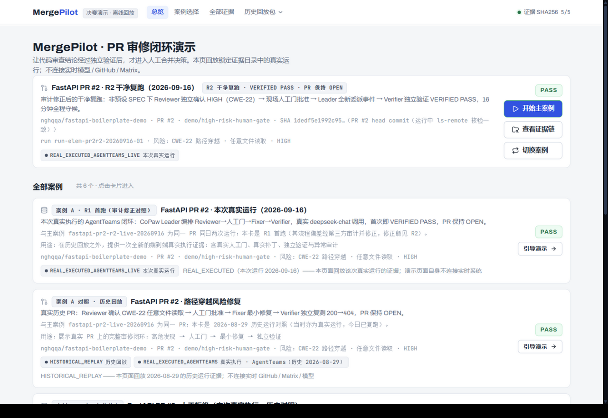

# MergePilot：多 Agent PR 审修闭环

**多 Agent 代码与数据库变更安全闭环系统**

普通变更，AI 自主完成。高危变更，系统停下等人工。

[](#agentloop-云端-trace)
[](#三条安全决策路径)
[](#rag-检索能力)
[](#polardb-与-branch-边界)
[](#polardb-与-branch-边界)
[]
[](https://github.com/nghqqa/MergePilot/actions/workflows/selftest.yml)
[](LICENSE)

> 上排红黄徽章不是缺陷，是**如实声明的当前边界**——本项目把"还没做到的"钉在第一屏。

## 演示

**Demo 视频（75 秒 · 1080p · 中文旁白，早期版本界面）**：[Watch Demo](https://github.com/nghqqa/MergePilot/releases/download/v0.2.0/MergePilot-demo.mp4)



**在线体验**：`git clone` 后执行 `cd demo-platform && node backend/server.mjs`，访问 `http://127.0.0.1:4173`（若该端口落在 Windows 保留段被拒，服务会自动顺延并在控制台打印实际地址）。零第三方依赖，无需 `npm install`。也可下载离线包 [MergePilot-demo-v0.3.0.zip](https://github.com/nghqqa/MergePilot/releases/download/v0.3.0/MergePilot-demo-v0.3.0.zip)（约 1.5 MB，含 6 案例）。

## 要解决的问题

AI 改代码很快，但企业不敢让它碰生产环境：出了高危漏洞谁负责？改坏了怎么追溯？MergePilot 解决的是"敢让 AI 改"这件事——每一步有审计，高危必须人工点头，拒绝就真的停下。

## 快速开始

**推荐顺序**：① 先跑演示平台（零依赖，无需 Docker）；② 需要完整隔离栈时，用离线镜像包 + 一键启动器（外部 Windows 机器已两轮实测 10/10）；③ 有网络时可选用 GHCR 镜像（预留，见 DEPLOY.md C）。

### 演示平台（推荐，零依赖）

```bash
git clone https://github.com/nghqqa/MergePilot.git
cd MergePilot/demo-platform
node backend/server.mjs        # 打开 http://127.0.0.1:4173
```

Node.js ≥ 18 即可，无需 `npm install`：前端已预构建（`frontend/dist/`），六个案例的回放证据随仓库分发（`evidence/PHASE14-*` + `evidence/FINALS-*`，SHA256 锁定）。Windows 也可直接双击 `demo-platform/start-demo.bat`。

自测：`node backend/test/selftest.mjs`（61 项：脱敏、回放完整性、API 契约、无泄密扫描、决赛证据等级与版本绑定闸门；2026-09-13 前为 54 项；[CI 在 Node 18/20/22 上自动运行](https://github.com/nghqqa/MergePilot/actions/workflows/selftest.yml)）。

不想 clone？下载 [MergePilot-demo-v0.3.0.zip](https://github.com/nghqqa/MergePilot/releases/download/v0.3.0/MergePilot-demo-v0.3.0.zip)（约 1.5 MB，含 6 案例证据与一键启动），解压后进入 `MergePilot-demo-v0.3.0` 目录，双击 `start-demo.bat` 或执行 `node MergePilot-demo/backend/server.mjs`。视频与历史版本见 [Releases](https://github.com/nghqqa/MergePilot/releases)。

### 完整隔离栈（离线镜像 + 一键启动）

当前交付：**[Release v0.2.1](https://github.com/nghqqa/MergePilot/releases/tag/v0.2.1)**——9 镜像 · zstd 单包（265MB · 逐镜像 digest 清单）+ **offline-config 配置包**（数据库 schema/角色初始化五件套 + `start-stack.bat|.sh` 两阶段启动器 + env 模板）。

```text
1. 下载 v0.2.1 的镜像包与配置包，解压到同一目录
2. load-images（Windows PowerShell / Linux 脚本均随包提供）
3. 双击 start-stack.bat —— 自动测量容器网络、写 .env、启动 7 服务
4. 验证：6 服务 healthy + PREFLIGHT_OK + http://127.0.0.1:8600 返回 200
```

**可复现性证据**：在一台独立外部 Windows 机器上完成两轮验证与一次复验——第一轮暴露交付缺口，十个启动门禁逐个拦下 8 类真实故障；修复后 rev2 版本 **10/10 通过标准全 PASS、零干预一键启动**。完整加载、校验与故障对照见 [DEPLOY.md](DEPLOY.md)。

AgentTeams（HiClaw）运行时镜像（嵌入式 Manager + CoPaw worker：Reviewer / Fixer / Verifier）单独提供：[runtime-images-20260912](https://github.com/nghqqa/MergePilot/releases/tag/runtime-images-20260912)。项目最初运行在 WSL2，后整体迁移至 **Docker Desktop for Windows** 并跑通全流程（由 Controller 统一 reconcile），三条案例的回放数据即产自该环境。

仓库内的 `docker-compose.yml` 与 `Dockerfile.*` 是隔离栈镜像的构建配方：开发态由 `tools/demo_console/one_click_startup.py` 编排调用；离线交付态由配置包内的 `start-stack` 脚本驱动 `docker compose`（含数据库 schema 初始化挂载）。源码开发与本地测试命令见 [CONTRIBUTING.md](CONTRIBUTING.md)。

## 三条安全决策路径

| 路径 | 案例 | 行为 | 验证点 |
| --- | --- | --- | --- |
| **自主完成** | PR #1（普通变更） | AI 审查 → 修复 → 验证，全自动完成，无人工介入 | 项目 completed · PR 保持 OPEN |
| **批准后完成** | PR #2（高危 · CWE-22） | 人工安全门 → 批准 → 修复 → 探针验证（200→404） | 修复有效 · PR 保持 OPEN |
| **拒绝后停止** | PR #3（严重 · CWE-78） | 人工拒绝 → 永久 BLOCKED → 409 终态 | 拒绝不可翻转 · 审计归档 |

> 2026-09-16：三条路径已在隔离栈上以**真实 AgentTeams 多 Agent 运行**复核——批准路径干净复跑（R2，见下节）、拒绝路径真实执行（零派发，三层证据）、自主路径沿用既有证据。

## 决赛真实运行（2026-09-16）：独立审计 → 修正 → 干净复跑

三条真实 AgentTeams 运行（非回放：真实派单、真实 deepseek-chat 调用、真实容器内执行、事件级留痕），并经**独立第三方审计**：

| 运行 | 结果 | 关键验收 | 证据 |
| --- | --- | --- | --- |
| **R2 主案例**（PR #2，CWE-22） | 非预设 SPEC 下 Reviewer 独立确认 HIGH → 现场人工门批准 → Leader 发出全新委派事件 → Verifier 独立验证 **VERIFIED PASS** | 门后**新委派事件** $uZ4Rj1SI…（≠任何被作废 ID），Fixer 零操作员介入 | [FINALS-ELEM-PR2-LIVE-20260916-R2](evidence/FINALS-ELEM-PR2-LIVE-20260916-R2) |
| **真实拒绝**（PR #3，CWE-78 RCE） | 操作员拒绝修复授权 → fix/verify **从未派发**，项目 blocked（消息/网关/状态存储三层印证） | 拒绝为终态，不可翻转 | [FINALS-ELEM-PR3-LIVE-20260916](evidence/FINALS-ELEM-PR3-LIVE-20260916) |
| **R1 首跑**（PR #2，同日早前） | 技术结论成立；门后派发链瑕疵被独立审计指出 → **如实修正**（AUDIT 修正版 v2），并以 R2 复跑闭环 | 审计发现→修正→复跑的完整记录 | [FINALS-ELEM-PR2-LIVE-20260916](evidence/FINALS-ELEM-PR2-LIVE-20260916) + AUDIT.md |

配套：**角色契约 v1.0**（Leader/Reviewer/Fixer/Verifier 跨案例冻结，新案例只填 [CASE-MANIFEST](tools/agentteams/roles/CASE-MANIFEST.template.md)）见 [tools/agentteams/roles/](tools/agentteams/roles/)；R2 用量 88 次调用 / 输入 4.65M token（98.9% 缓存命中）/ ≈¥1.1–2.5，全程网关日志逐条可查。

## Agent 协同设计

Reviewer、Fixer、Verifier 三个 Agent 职责分离、互相制衡：

- **Reviewer** 只做语义判断与风险分级（NORMAL / HIGH / CRITICAL 三级；`benchmark/` 数据集对同一维度标注为 L0 / L1 / L2），不修改代码
- **Fixer** 在被派发前保持 LOCKED，高危时必须等人工门放行
- **Verifier** 用独立探针复核修复效果（不信任 Fixer 的自述），结果写入 MinIO 证据
- **人工安全门**：高危时系统自动暂停（Fixer/Verifier LOCKED），批准或拒绝均为真实人工记录，拒绝后 409 终态不可翻转
- **DAG 依赖**：review-1 → fix-1 → verify-1，逐级锁定防止越权

Agent 只承担语义判断，六类 Skill 以 Schema、deadline、错误码和 fail-closed 合同执行。Workflow Controller 负责状态机、确定性交接、CAS、超时 HOLD 和回滚；Policy Gateway 负责 ALLOW/DENY/HOLD；GitHub MCP 是隔离服务，PAT 不进入 Worker。

角色行为契约 v1.0（Leader/Reviewer/Fixer/Verifier 跨案例冻结，新案例只填 [CASE-MANIFEST](tools/agentteams/roles/CASE-MANIFEST.template.md)）见 [tools/agentteams/roles/](tools/agentteams/roles/)。

想在自己的环境复用这套 Agent 设计与 Skill？按投入分四级（验证 / 单独跑 Skill / 完整闭环 / 指向你自己的仓库的真实闭环）：见 [docs/agent-runtime-adoption.md](docs/agent-runtime-adoption.md) 与 [docs/real-loop-your-repo.md](docs/real-loop-your-repo.md)。


源图（可编辑 SVG）：[`docs/assets/mergepilot-architecture.svg`](docs/assets/mergepilot-architecture.svg)

## AgentLoop 云端 Trace

全流程已接入阿里云 AgentLoop，Agent + LLM + Tool 三类 span 合并在同一条链路。

**权威 Trace**：`fbf4a3cec0493990d76e10a102418be1`（真实 CoPaw 运行，17.6s）

| 指标 | 值 |
| --- | --- |
| Agent 调用 | 1 |
| LLM 调用 | 24 |
| 工具调用 | 8 |
| 总 Token | 51,890（入 49,867 / 出 2,023） |
| 模型 | deepseek-chat |
| 会话 ID | N2KQqHVSBsSZc9utWsEeZ5f |

span 父子关系：`agent_step → invoke_agent → { chat deepseek-chat（原生）+ genai.llm.call（loongsuite 包装）+ tool.projectflow + tool.taskflow + matrix.send }`。原生 agentscope span 与 loongsuite 包装 span 共享全局 TracerProvider，天然合并。

## RAG 检索能力

内置 8 篇合成演示文档（9 分块），支持自然语言检索并返回引用来源。

- 每次检索返回 `query_hash`（不保存原文）、`top_k`、逐条 `{document_id, chunk_id, score, source_ref}`
- **无引用来源的答案不会被标记为已验证**
- 数据模式为 SYNTHETIC/REDACTED（合成演示集，非企业语料）
- 嵌入：本地确定性哈希词袋（无外部服务依赖）；检索策略 `v2-bigram-idf-hash4096`，由离线闭环从 `v1-unigram-hash256` 晋级（按语义族切分调优/held-out，held-out hit@1 75.0% → 91.7%，证据 `evidence/FINALS-RAG-LOOP-20260914`）

## PolarDB 与 Branch 边界

| 项 | 状态 |
| --- | --- |
| PolarDB | **NOT CONNECTED**（8 项接入门槛已在代码中预留） |
| Database Branch | **SIMULATED**（隔离模拟环境上的验证状态机） |
| PR Auto Merge | **DISABLED** |
| 候选 A 迁移验证（决赛新增） | **ISOLATED_POSTGRES** —— 在独立 PostgreSQL 克隆库上**真实执行** SQL 迁移与断言；**不是** Agentic Database 分支验证 |

支持 create_branch → validate_migration → assert_data → rollback_check 全链路（三候选对照仍在模拟 fixture 上运行）。真实 PolarDB 接入需满足 8 项门槛后由环境变量切换。

## 仓库结构

```
MergePilot/
├── demo-platform/       # 演示平台：前端 + 后端 + RAG + PolarDB 模拟适配器
│   ├── backend/         # 零依赖 Node 后端（server + API + RAG + PolarDB 边界）
│   ├── frontend/        # React 控制台（含预构建 dist）
│   ├── evidence-adapter/# 只读数据适配层 + 内置演示数据集
│   ├── rag-data/        # RAG 合成数据集
│   ├── SKILLS.md        # 核心 Skill 清单
│   └── test/            # 自测脚本（61 项）
├── evidence/            # 回放证据子集（SHA256 锁定）
├── shared/              # 数据契约
├── docs/                # 文档与架构图
├── skills/              # Agent Skill 定义
├── config/              # 配置
└── LICENSE              # Apache 2.0
```

## 评估方法

结果评估与轨迹评估**分开执行、分别呈现**：

- **结果评估**（最终状态）：关联仓库识别、影响表识别、历史风险命中、候选结论、数据核对、回滚检查、人工门终态
- **轨迹评估**（过程顺序）：先检索 RAG、正确选择工具、创建隔离 Branch、拒绝后锁定、source_refs 保留、Agent→LLM→Tool Trace 形成

即使最终状态正确，若过程顺序违规（如未检索先动手、跳过人工门），轨迹评估仍判不通过。

## 决赛新增（2026-09-14）：三个可复现闭环，各带证据等级

| 闭环 | 做了什么 | 证据等级（如实） | 证据 / 复现 |
| --- | --- | --- | --- |
| 数据库迁移验证纳入 PR 验收 | `tools/audit-db/m9_migration_verification.sql` 在不可变 `revision_bindings` 与 `approvals` 之上挂 4 张不可变子表 + `db_release_gate()`；`tools/dbverify` 在克隆库上真实跑：代码测试 PASS → 迁移因历史数据 **FAIL(23502)** → 补取信息 → 修订同一候选 → **PASS 11/11** → 审批绑定版本 → 追加提交后旧批准 **STALE**；**授权执行点 `l2_claim_ticket` 内强制 `db_release_gate`**（stale/摘要变化/未批准/过期 → 不进 EXECUTING）；交付迁移方案包 `release/migration-plans/` | **真实 SQL 验证（ISOLATED_POSTGRES）**，非 Agentic Database 分支；PolarDB 仍 NOT CONNECTED | `evidence/FINALS-DB-MIGRATION-LOOP-20260914` · `python tools/dbverify/run_migration_loop.py` |
| 多 Agent 返工闭环 | 真实 `controller.py::process_event` + 真实 PostgreSQL + 真实验收测试驱动 VERDICT：review → fix#1 → **verify FAIL → 退回 Fixer** → fix#2 → verify PASS；重试上限 HOLD、BLOCKED 升级、非法输入 | **机制验证**：Agent 语义输出为受控输入；无 LLM、无 Matrix/Element 真实交接（另一等级，未执行） | `evidence/FINALS-REWORK-LOOP-20260914` · `python tools/agentteams/rework_loop_harness.py` · 演示页 `/rework` |
| RAG 观测→评估→数据集→优化→回测 | 观测（tool-span 审计：127 行 retrieve 仅 12 个不同查询）→ 18 语义族 54 条标注查询按族切分 → 调优集选策略 → held-out 单次回测 → 晋级 v2 | **真实离线实验**，语料 SYNTHETIC/REDACTED，小样本 | `evidence/FINALS-RAG-LOOP-20260914` · `node demo-platform/backend/experiments/rag-loop/rag_eval_loop.mjs` |
| 可靠性对照 | 长/跨文件 PR、小上下文、诱导性注释、干净对照、伪造批准 × 确定性层（diff_parse / risk_classify / sast_scan） | 确定性层**真实执行**（5/5 决策正确、0 误报 0 漏报）；模型轴 **NOT_EXECUTED**（付费调用需授权） | `evidence/FINALS-RELIABILITY-20260914` · `python benchmark/reliability/run_reliability.py` |

演示平台 PR#4 页现在回放上述真实 SQL 证据并提供**版本绑定的人工门**（REPLAY overlay，NO RUNTIME WRITE；旧版本批准返回 409）。

## 技术栈

- **主项目**：Python（pyproject.toml）· 1490 tests（可复现命令见 CONTRIBUTING）· 6 类 Skill · 4 Agent 承载 6 类职责
- **演示平台**：Node.js 零依赖后端 + React 前端（Vite 预构建）
- **可观测**：OpenTelemetry GenAI 语义约定 · loongsuite 探针 · 阿里云 AgentLoop

## 提交材料

- [`submission/`](submission/) — 决赛提交文档：SKILLS.md（分级如实口径）、跨仓 Schema 审查 Skill、演示平台 DEPLOY 说明与 `.env.example`、路演备用网页版（含同版 PDF）
- 离线交付方案与外部机器验证记录：见 [Release v0.2.1](https://github.com/nghqqa/MergePilot/releases/tag/v0.2.1) 与 [DEPLOY.md](DEPLOY.md)

## 许可

[Apache License 2.0](LICENSE)
