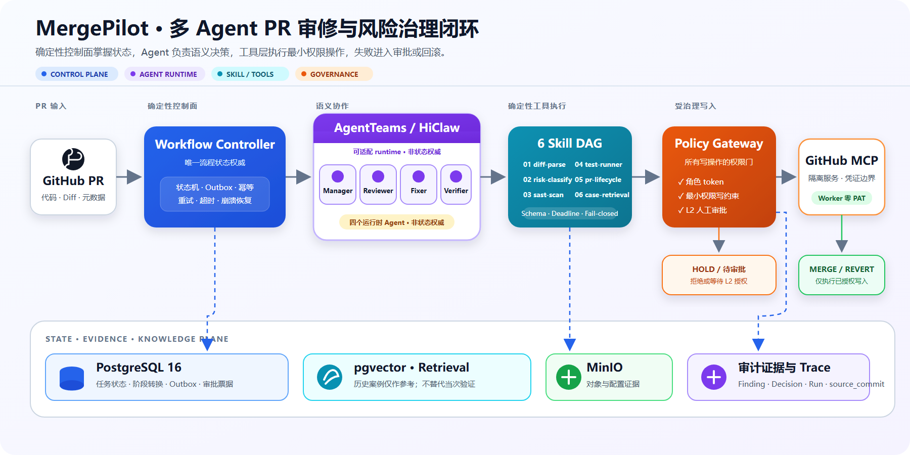
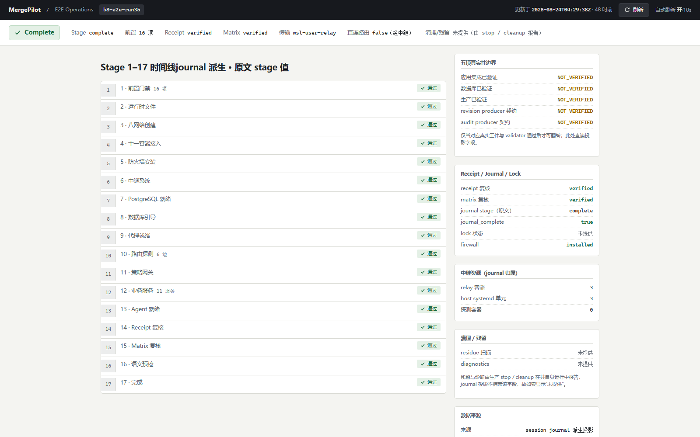
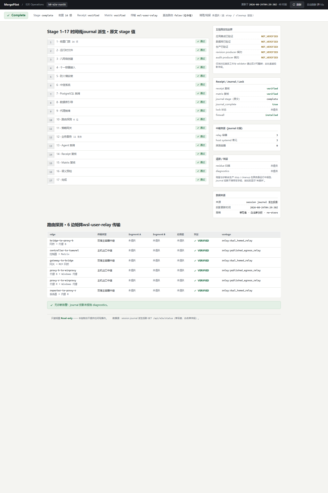
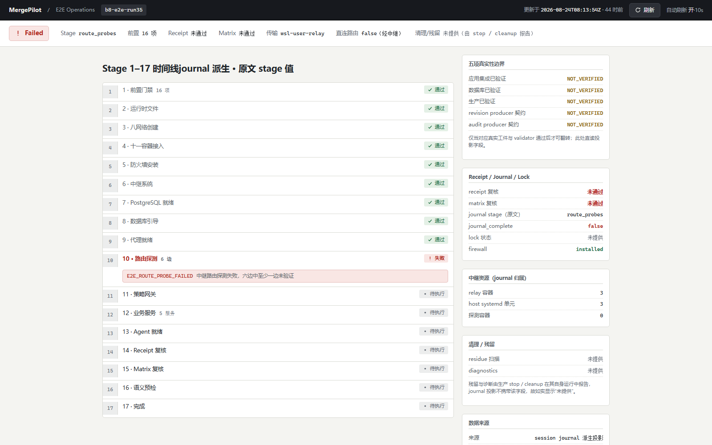

# MergePilot

## 多 Agent PR 治理控制面

[](https://github.com/nghqqa/MergePilot/releases/tag/v0.1.0-preview.4)
[](docs/复赛材料/finals-v1/04-声明证据矩阵.md)
[](LICENSE)

MergePilot 把 PR 审查、修复、验证、审批、合并与回滚放进确定性控制面。Agent 负责语义判断；Controller、Gateway 和审计事实负责状态、权限、幂等与恢复。

> 当前公开版本：`v0.1.0-preview.4`（merged main / manifest `5bb2635`）。这是 Windows 11 + WSL2 Preview，不是 production ready。

## 当前状态

- 同机黑盒验收：`SAME_MACHINE_ACCEPTED`
- 独立物理机验收：`EXTERNAL_BLOCKED`
- 冻结门禁：`2471 passed / 0 failed / 20 skipped`
- 传输：`wsl-user-relay`；`direct_routing_verified=false`
- 9 个离线镜像；OCI tar 约 847MB

## 架构



源图（可编辑 SVG）：[`docs/assets/mergepilot-architecture.svg`](docs/assets/mergepilot-architecture.svg)

Agent 只承担语义判断，六类 Skill 以 Schema、deadline、错误码和 fail-closed 合同执行。Workflow Controller 负责状态机、确定性交接、CAS、超时 HOLD 和回滚；Policy Gateway 负责 ALLOW/DENY/HOLD；GitHub MCP 是隔离服务，PAT 不进入 Worker。PostgreSQL、pgvector、MinIO 与审计和可观测平面分别承担状态、检索、对象和证据关联职责。

当前运行时是 **4 个 Agent 承载 6 类职责**：Manager/Coordinator、Reviewer、Fixer、Verifier；Triage 下沉为 `diff-parse` / `risk-classify` Skill，Fix Planning 收敛为规划阶段与状态机。

## 只读控制台

截图来自当前 `e2e-status.html` 页面和真实 E2E 投影，不是手绘示意图。控制台为 GET-only、loopback-only，不提供写操作。

### 总览



展示 17 阶段时间线、只读证据链和真实性边界。不代表生产系统或独立物理机验收。

### 完整证据



展示 16/16 前置检查、6/6 路由边和 Receipt/Matrix 状态。数据来自同机 Preview 投影。

### 失败定位



展示失败阶段、首个稳定错误 `E2E_ROUTE_PROBE_FAILED` 和后续阶段停止。它用于说明 fail-closed 行为，不是客户生产事故。

## 快速开始

从 [v0.1.0-preview.4 Release](https://github.com/nghqqa/MergePilot/releases/tag/v0.1.0-preview.4) 下载 7 项资产。先校验 `checksums.sha256` 与 `SHA256SUMS`，再按包内 README 执行：

```powershell
.\bootstrapper.ps1 -Action Check
.\bootstrapper.ps1 -Action Install -ImageTar .\images-oci.tar
.\bootstrapper.ps1 -Action Doctor
.\bootstrapper.ps1 -Action Start
.\bootstrapper.ps1 -Action Status
.\bootstrapper.ps1 -Action Stop
.\bootstrapper.ps1 -Action Cleanup
```

Standalone 包不需要源码仓或 Git；只有显式 `--build-from-source` 才检查源码构建布局。校验失败或镜像集合不一致时，Install 在 `docker load` 前停止。

## 平台支持与路线

当前正式 Preview 支持 **Windows 11 + WSL2**。`bootstrapper.ps1`、`wsl-user-relay` 和 Windows loopback 发布边（`127.0.0.1:8600/8090`）属于当前 Windows 运行路径；它们不是对 Linux/macOS 已完成支持的声明。

七个生命周期动作（`Check`、`Install`、`Doctor`、`Start`、`Status`、`Stop`、`Cleanup`）和 OCI 镜像、manifest、checksum、fail-closed 所有权合同按平台中立原则设计。Linux 原生 Docker、macOS Docker Desktop/Colima 以及跨平台单文件入口属于后续路线，尚未纳入本次 Preview 验收，也不应被理解为当前可用功能。

跨平台路线的重点是 provider 化 Docker 访问和传输层：Windows 保留 WSL2 relay，Linux/macOS 采用本机 Docker 端点，同时继续保持 loopback-only。完成对应平台的真实安装、生命周期和端口证据后，才会更新平台支持声明。

## 复赛材料与证据

- [复赛材料最终整理版](docs/复赛材料/finals-v1/)
- [代码包说明](docs/复赛材料/finals-v1/02-代码包说明.md)
- [Demo 脚本](docs/复赛材料/finals-v1/03-Demo脚本.md)
- [声明证据矩阵](docs/复赛材料/finals-v1/04-声明证据矩阵.md)
- [材料约束](docs/复赛材料/00-材料约束.md)
- [仓库证据目录](evidence/)

## 真实性边界

以下边界保持未验证：

```text
application_integration_verified=false
database_verified=false
production_verified=false
revision_producer_contract=NOT_VERIFIED
audit_producer_contract=NOT_VERIFIED
direct_routing_verified=false
transport_profile=wsl-user-relay
```

Preview 的同机验收不等于独立物理机验收，也不构成生产验证。Showcase 和播种投影用于解释控制面行为，不冒充客户数据或生产事故。

## 许可

[Apache License 2.0](LICENSE)
