# MergePilot

> 多 Agent PR 审修与风险治理闭环：把审查、修复、验证、L2 审批、合并与回滚放进确定性控制面，并留下可审计的结构化事实。

MergePilot 面向“LLM 能提出建议，但不能独自承担工程控制面”的问题。高风险操作必须经过 Policy Gateway 与人工审批；任何环节不确定时 fail-closed，失败后可以沿审计事实执行 revision-cut / rollback。

> **当前范围**：Apache-2.0 开源原型，已完成隔离栈组件验证与 deterministic showcase；M8 尚未完成，应用集成与生产验证尚未进行（详见「测试与真实性边界」）。

---

## 解决什么问题

| 工程治理问题 | MergePilot 的确定性机制 |
|---|---|
| 受保护分支和路径可能被越权修改 | Policy Gateway 对工具调用给出 ALLOW / DENY / ERROR，命中保护前缀立即拒绝 |
| 高风险合并不能只依赖 Agent 判断 | L2 approval ticket、单次有效授权与 SHA/CAS 校验 |
| 多 Agent 阶段可能乱序、重复或崩溃 | PostgreSQL 状态机、Outbox、幂等事件与可恢复阶段推进 |
| 审批后 revision 发生漂移 | approved / observed SHA 对比，检测 `REVISION_DRIFT` 后 fail-closed |
| 合并或复验失败需要可恢复 | revision-cut / rollback + re-verify，状态收敛到 `RECOVERED` |
| 结果难以审计 | `mcp_calls`、`audit_events`、rollback facts 与只读 snapshot |

设计立场：**Prompt 负责语义，确定性控制面负责权限、状态、证据与失败恢复。**

---

## 系统架构

<p align="center">
  <a href="docs/showcase/architecture.svg">
    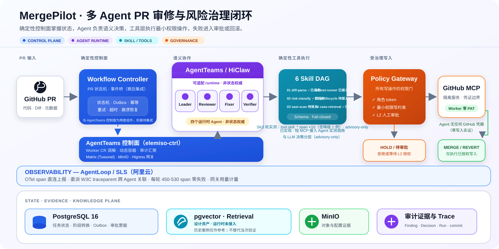
  </a>
</p>

架构按职责拆成四条清晰链路：

- **控制链**：PR → Policy Gateway → Controller；
- **事实链**：Controller / Gateway → PostgreSQL 审计状态库；
- **展示链**：read-only snapshot → Demo Console → console-edge → loopback browser；
- **启动门禁**：Preflight 独立执行 10 项合同检查，全部通过才输出 `PREFLIGHT_OK`。

关键边界：console-edge 只是 publication plumbing；deterministic seed 只用于展示；Demo Console 只读；M8-A1 不等于 revision producer integration。

---

## 三个确定性案例

三个案例均来自 `tools/demo_console/showcase_cases.py`，基于合成仓库 `mergepilot/showcase-demo` 的确定性种子数据。

| 案例 | 治理链路 | Policy / Evidence | 最终结果 |
|---|---|---|---|
| **A · Protected Merge Success** | review → fix → verify PASS → merge | ALLOW + L2 ticket + five-step audit | **MERGED** |
| **B · Fail-Closed Rejection** | review → fix DENIED，时间线立即终止 | `PROTECTED_PATH_PREFIX` + policy_deny | **FAIL** |
| **C · Revision Drift Recovery** | merge → drift-check → rollback → re-verify | `REVISION_DRIFT` + rollback facts | **ROLLED_BACK / RECOVERED** |

**A · Protected Merge Success** — `run-showcase-a` · PR `#101` · L2 `tkt-showcase-a-l2`

- `case_id=case-showcase-protected-merge-success`；Policy INTENT / RESULT 均为 `ALLOW`，最终状态 `MERGED`。
- base `73686f77636173652d612d626173650000000000` · head `73686f77636173652d612d686561640000000000` · merge `73686f77636173652d612d6d6572676500000000`

**B · Fail-Closed Rejection** — `run-showcase-b` · PR `#102`

- `case_id=case-showcase-failclosed-policy-rejection`；`create_or_update_file` 命中 `samples/`，Policy 返回 `DENY / PROTECTED_PATH_PREFIX`，时间线立即终止，最终状态 `FAIL`。
- base `73686f77636173652d622d626173650000000000` · head `73686f77636173652d622d686561640000000000`；无 merge SHA、无后续 verify / merge 阶段。

**C · Revision Drift Recovery** — `run-showcase-c` · PR `#103` · L2 `tkt-showcase-c-l2`

- `case_id=case-showcase-revision-drift-recovery`；`REVISION_DRIFT` 触发 rollback，re-verify `PASS`，最终 `ROLLED_BACK / RECOVERED`。
- approved head `73686f77636173652d632d686561640000000000` · merge `73686f77636173652d632d6d6572676500000000` · observed drift `73686f77636173652d632d647269667400000000` · recovered `73686f77636173652d632d7265636f766572656400000000`

---

## 8 页面控制台

截图来自隔离栈的 live snapshot：CSS viewport 为 1440×900、`deviceScaleFactor=2` 捕获，PNG 像素尺寸为 2880×1800。

<table>
  <tr>
    <td width="50%"><strong>01 · Overview</strong><br>运行身份、PR、SHA 与最终状态<br>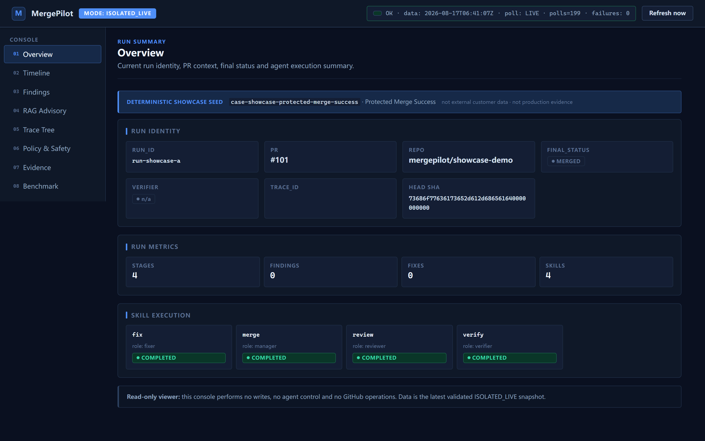</td>
    <td width="50%"><strong>02 · Timeline</strong><br>阶段顺序、owner、verdict 与时间<br>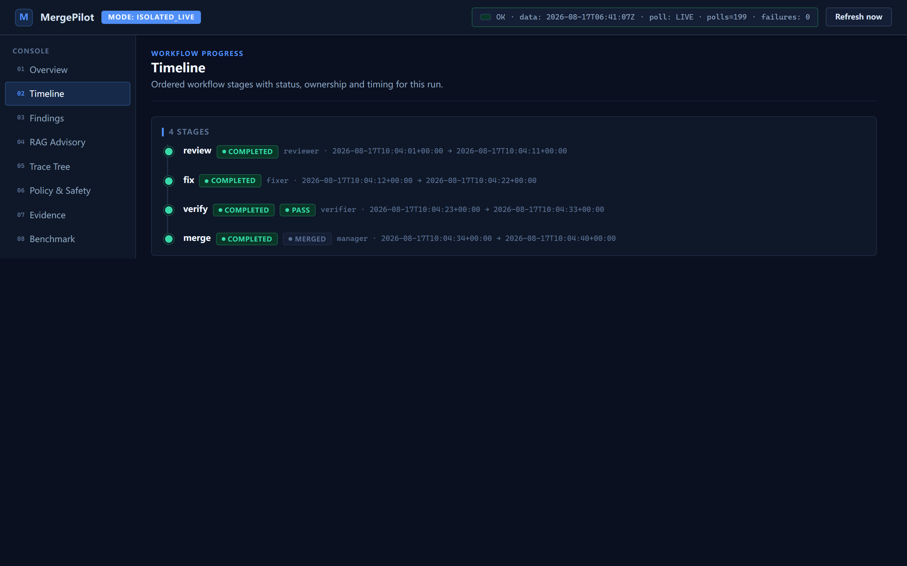</td>
  </tr>
  <tr>
    <td width="50%"><strong>03 · Findings</strong><br>Policy DENY 与 fail-closed 事实<br>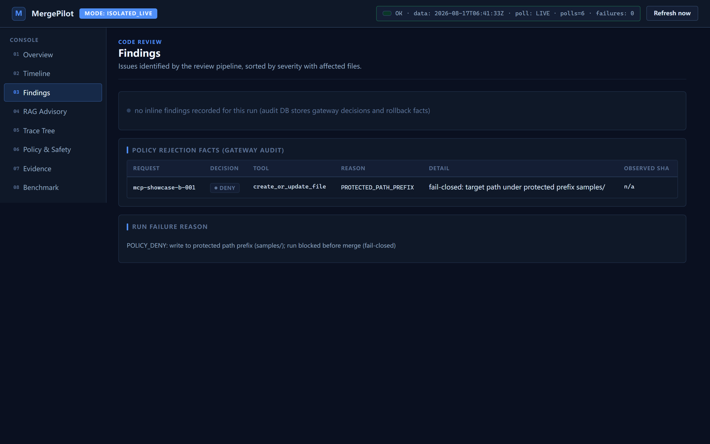</td>
    <td width="50%"><strong>04 · RAG Advisory</strong><br>真实 `not_measured` 能力边界<br>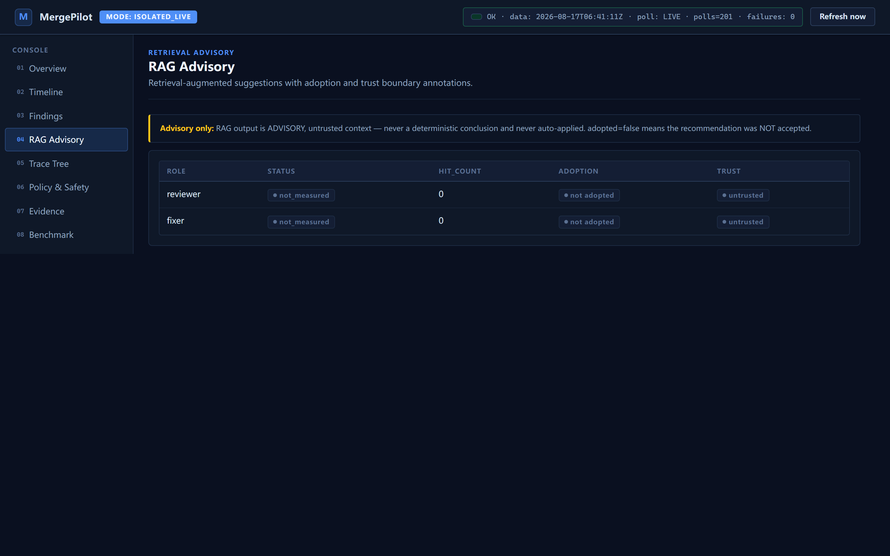</td>
  </tr>
  <tr>
    <td width="50%"><strong>05 · Trace Tree</strong><br>Gateway INTENT / RESULT 决策链<br>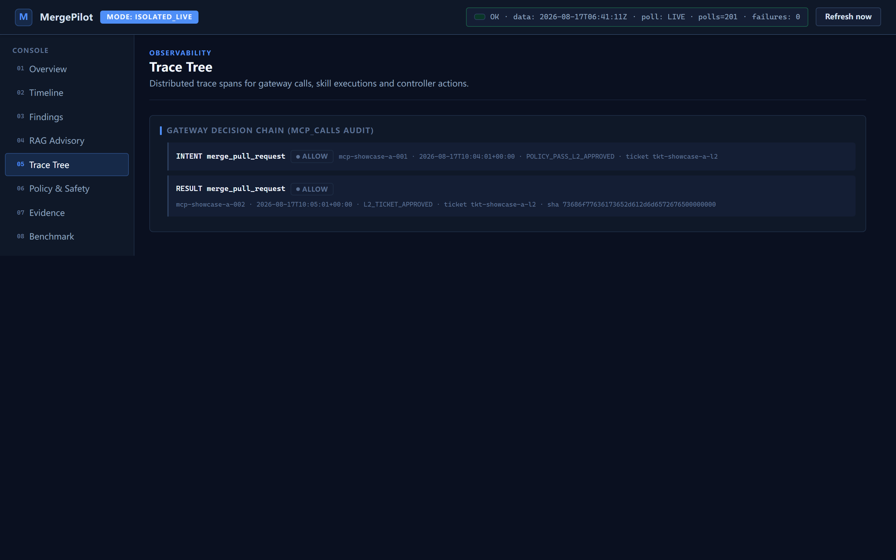</td>
    <td width="50%"><strong>06 · Policy &amp; Safety</strong><br>ALLOW / DENY 汇总与 rollback facts<br>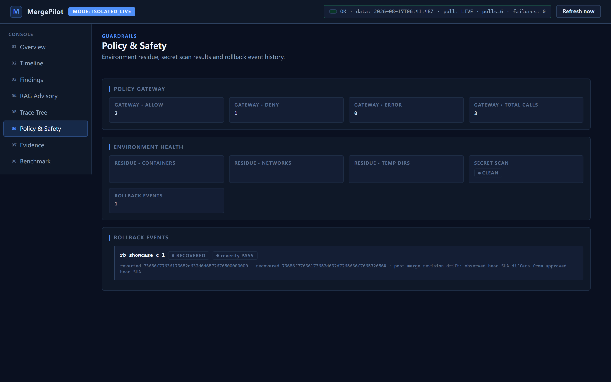</td>
  </tr>
  <tr>
    <td width="50%"><strong>07 · Evidence</strong><br>L2 ticket、audit summary 与完整性<br>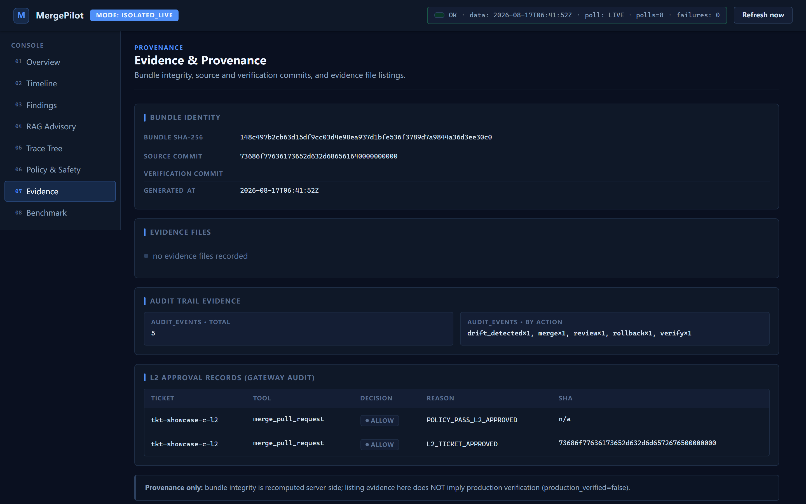</td>
    <td width="50%"><strong>08 · Benchmark</strong><br>诚实展示 `NOT_MEASURABLE_WITH_CURRENT_RUNTIME`<br>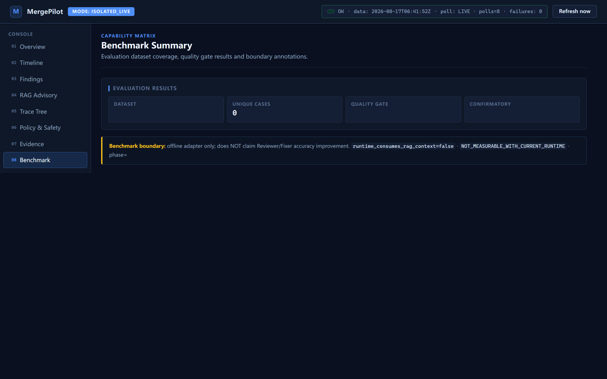</td>
  </tr>
</table>

### Mobile · CSS viewport 390×844

移动端同样以 DPR=2 捕获，PNG 像素尺寸为 780×1688。

<table>
  <tr>
    <td width="50%"><strong>Overview · Case A</strong><br>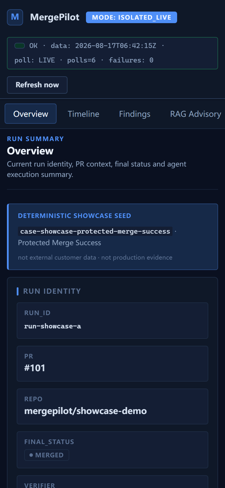</td>
    <td width="50%"><strong>Timeline · Case B</strong><br>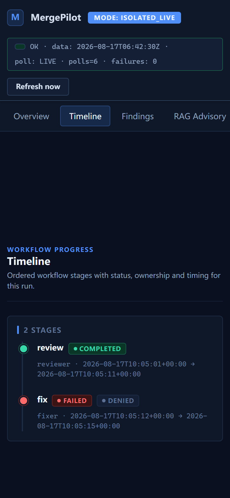</td>
  </tr>
  <tr>
    <td width="50%"><strong>Safety · Case C</strong><br>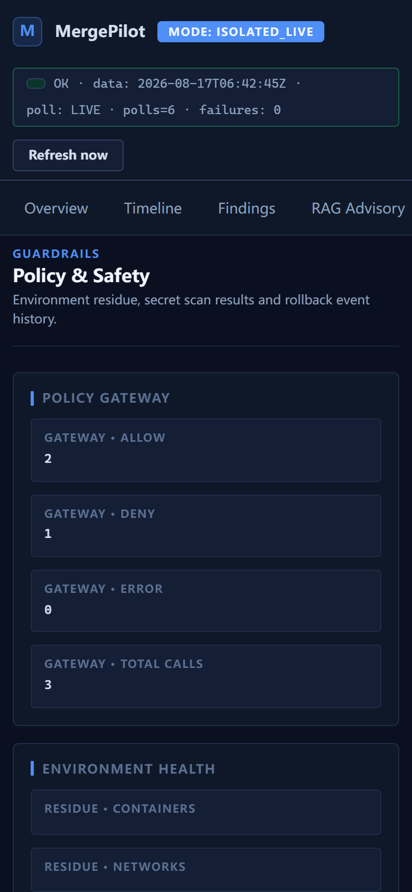</td>
    <td width="50%"><strong>Evidence · Case C</strong><br>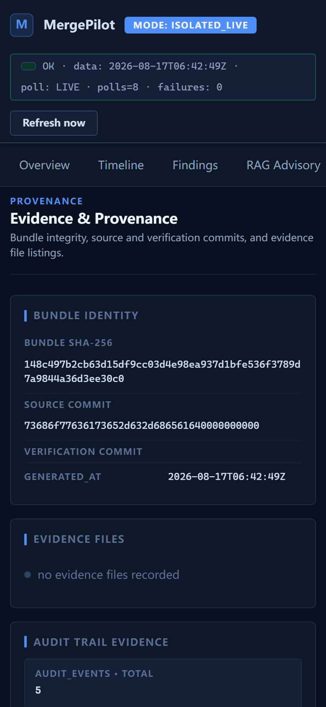</td>
  </tr>
</table>

---

## Quick Start（隔离栈）

### 前置条件

- Windows + WSL2；Docker daemon 通过 `unix:///var/run/docker.sock`；
- 宿主 Python 3.12；镜像基于 `python:3.12-slim` 与 digest 固定的 `pgvector/pgvector`；
- 真实 PostgreSQL 测试仅在 `EPHEMERAL_PG_VERIFY=1` 时执行，默认保持 unset。

### 构建镜像

```bash
docker build -f Dockerfile.policy-gateway -t mergepilot-isolated-policy-gateway:local .
docker build -f Dockerfile.controller -t mergepilot-isolated-controller:local .
docker build -f Dockerfile.demo-console -t mergepilot-isolated-demo-console:local .
docker build -f Dockerfile.console-edge -t mergepilot-isolated-console-edge:local .
docker build -f Dockerfile.preflight -t mergepilot-isolated-preflight:local .
```

完整启动 argv 由 `tools/demo_console/one_click_startup.py` 生成：网络 → PostgreSQL → Gateway → Controller → Demo Console → Edge → Preflight。密码和 DSN 只通过 0600 secret 文件传递，不进入 argv 或日志。

可选择 `run-showcase-a`、`run-showcase-b` 或 `run-showcase-c` 作为 Demo Console 的 `run_id`。浏览器只访问 loopback publication：`http://127.0.0.1:8600`。

### Seed 与清理

```bash
python tools/demo_console/showcase_cases.py > <showcase-seed.sql>
# 使用你自己的临时管理连接，以 --single-transaction 和 ON_ERROR_STOP=1 注入
```

清理计划同样由 `one_click_startup.py` 生成，覆盖容器、匿名卷、internal network 与 publication bridge。

### 不需要 Docker 的回归

```bash
python -m pytest -q tests/demo_console tests/isolated_live tests/verification --import-mode=importlib
```

---

## 演示脚本

5 分钟演示流程见 [`docs/showcase/demo-script.md`](docs/showcase/demo-script.md)。

---

## 测试与真实性边界

| 验证项 | 已完成结果 |
|---|---|
| PR‑V1 visual system | 81 passed |
| PR‑V2 deterministic cases | 60 passed |
| Showcase materials | 50 passed |
| M8‑A2‑a PR fixture | 31 passed |
| 当前拆分回归 | **1276 passed / 13 skipped / 0 failed** |
| audit seed replay | showcase audit rows **12 → 12**；task_runs 3 → 3 |
| recovered SHA | API snapshot、Desktop、Mobile 三侧可见 |
| component smoke | 5 services healthy + `PREFLIGHT_OK` 10/10 |
| M8‑A2‑a 六容器 fixture E2E | **11 PASS / 0 FAIL**（bind-first 成功链 + 两个负向案例） |

冻结边界：

- `application_integration_verified=false`
- `database_verified=false`
- `production_verified=false`
- `revision_producer_contract=NOT_VERIFIED`
- `audit_producer_contract=NOT_VERIFIED`
- M8-A1 是 event ingestion machinery，不等于 revision producer integration；M8-A2-a 已通过隔离六容器 fixture 验证，完整外部 producer integration 尚未完成。
- AgentTeams 仍是多 Agent 协同与任务编排基座；本次 fixture E2E 仅验证 MergePilot 控制面，真实 AgentTeams producer integration 尚未完成。

Showcase 是隔离栈上的确定性演示，不可外推为生产或真实客户验证；showcase material 不写入 `evidence/` 或 `verification/`。不声称完整 WCAG 合规，键盘导航、reduced-motion 与 browser console 保留 PR‑V1 的 residual validation 披露。

---

## 文档与贡献

本 README 是公开项目的当前入口与真实性边界说明；[文档索引](docs/README.md) 说明各类材料的用途和时效。

- 新贡献者请先阅读 [CONTRIBUTING.md](CONTRIBUTING.md)；面向 Agent 的仓库规则见 [AGENTS.md](AGENTS.md)。
- 当前设计与使用入口：本 README、[Showcase 演示脚本](docs/showcase/demo-script.md) 与 [Isolated-live 设计记录](docs/ISOLATED-LIVE-PG-Ephemeral-Verification-Design.md)。
- 历史里程碑和竞赛提交快照：[项目状态记录](docs/项目状态.md)、[初赛证据索引](docs/初赛证据索引.md)、[初赛声明—证据矩阵](docs/初赛声明-证据矩阵.md)、[历史运行记录](docs/README-历史运行记录.md)。这些文档保留当时结论，不是当前能力的独立声明。
- 可复现性与归档材料：[benchmark 摘要](benchmark/formal-summary.md)、[`evidence/`](evidence/)（历史验证资产）与 [`verification/`](verification/)（当前验证约定）。

---

## 仓库结构

```text
MergePilot/
├── tools/
│   ├── policy-gateway/       # Policy、L2 approval、INSERT-only audit
│   ├── workflow-controller/  # 状态机、Outbox、恢复与 rollback
│   ├── audit-db/             # PostgreSQL 审计 schema 与权限
│   └── demo_console/         # 8-page live console + console-edge
├── tests/                    # 业务合同、负向矩阵、组件与材料测试
├── docs/showcase/            # 架构图、演示脚本与 @2x 展示资产
└── README.md
```

## 许可

[Apache License 2.0](LICENSE)。
