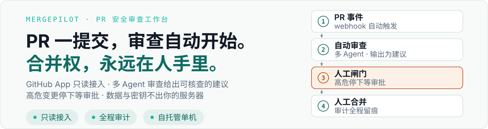
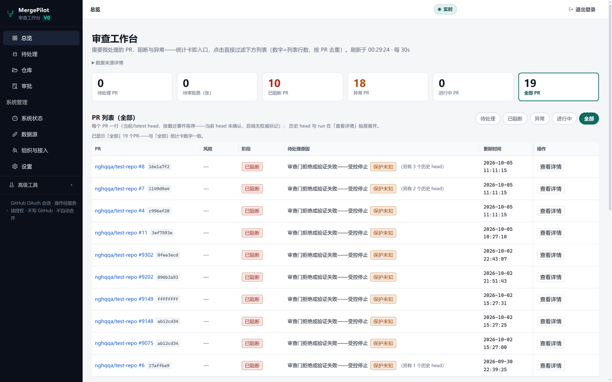
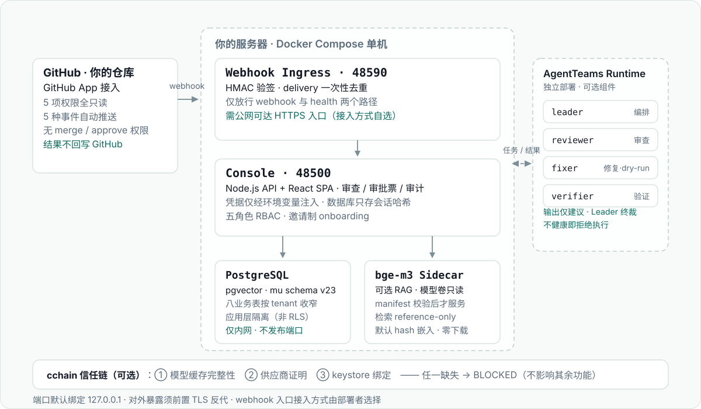

# MergePilot — 自托管 PR 安全审查工作台

[](LICENSE)
[](https://github.com/nghqqa/MergePilot/releases/tag/v0.2.0-beta.6-rc.16.1)


<p align="center">
  <picture>
    <source media="(prefers-color-scheme: dark)" srcset="./docs/assets/readme/hero-dark.svg">
    
  </picture>
</p>

MergePilot 跑在你自己的服务器上：通过 GitHub App **只读**接入仓库，PR 事件自动触发多 Agent 审查；
发现与证据全程留痕，高危变更停下等人工审批。它从不代替你合并或批准——所有 Agent 输出仅为**建议**，
最终裁决由维护者做出，代码与密钥不出你的环境。

## 解决什么问题

- **AI 审查的结论不该直接可信** —— Reviewer / Fixer / Verifier 的输出都按"建议"处理，附可核查的证据，由人终裁。
- **高危变更不能静默通过** —— 修复执行默认 dry-run；真实写入走审批票硬门，仅维护者可放行。
- **代码与密钥不该出站** —— 单机自托管、只读接入，数据落在你自己的 PostgreSQL 里，凭据只经环境变量注入。

## 适合谁

- **个人开发者**：给自己的仓库加一台带审计的只读审查台（基础档 2C2G）。
- **小团队**：内网自托管、五角色 RBAC 协作；可选把团队规范做成可检索的本地语料（推荐 4C8G 起）。
- **暂不适合**：需要 RLS 行级隔离、SSO/SCIM、HA 或配额限流的企业生产环境——见[能力边界](#能力边界请务必阅读)与下文对照表。

## 三步上手

前提：Docker Engine 24+ / Docker Compose v2。

```bash
git clone https://github.com/nghqqa/MergePilot.git
cd MergePilot/deploy/selfhost
cp .env.example .env                    # 按注释填写必填段（GitHub App 凭据等），chmod 600 .env
node preflight.mjs                      # 只读体检：缺什么直接告诉你
docker compose --env-file .env up -d    # 首次启动自动建表（mu schema v23）
node preflight.mjs --live               # 活体探测：health / schema / queue
```

1. 浏览器打开 `http://127.0.0.1:48500/multiuser`（端口默认仅绑定回环地址）。
2. 创建你自己的 GitHub App —— 需要**两个**：GitHub App 收 webhook + OAuth App 做用户登录，
   约 10 分钟，逐步向导见 [BETA-GUIDE §4–§5](docs/BETA-GUIDE.md)。
3. 管理员按 GitHub 数字 user id 邀请成员 → 登录 → 安装 App 绑定仓库 → 开一个 PR，看审查自动跑起来。

> 也可以直接下载发行包起步：[GitHub Release v0.2.0-beta.6-rc.16.1](https://github.com/nghqqa/MergePilot/releases/tag/v0.2.0-beta.6-rc.16.1)
> （离线镜像 + deploy-kit + SBOM + 扫描报告 + 校验和）。

## 界面



<details>
<summary>总览页说明</summary>

统计卡即过滤入口（数字 = 列表行数，按 PR 去重）；每个 PR 一行展示当前/latest head 的风险与阶段，
历史 head 与审查 run 在「查看详情」抽屉展开。数据每 30s 刷新，来源与推导口径在「数据来源详情」展开可见。

</details>

## 官方镜像与发行包

官方镜像发布在 GHCR（不可变 digest）：`ghcr.io/nghqqa/mergepilot-console`。
`deploy/selfhost/docker-compose.yml` 已钉定当前 digest，升级/回滚只需改镜像引用后 `docker compose up -d`。

| 附件 | 说明 |
|---|---|
| `mergepilot-console-rc16.tar` | 离线镜像（`docker load` 导入，与 GHCR 镜像同源） |
| `mergepilot-selfhost-deploy-kit-rc16.tar.gz` | 自托管套件（compose 模板 / .env.example / preflight / webhook-only ingress） |
| `rc16-sbom.cdx.json` | CycloneDX SBOM（35 组件） |
| `scan-rc16.json` | trivy 扫描存档（2026-10-06 时点：漏洞 0 / 秘密 0，不构成永久无漏洞声明） |
| `SHA256SUMS-rc16.1.txt` | 附件校验和 |

**版本口径，别互相替代**：

- Release / 源码 tag：`v0.2.0-beta.6-rc.16.1`
- 镜像内置运行时版本：`0.2.0-beta.6-rc.16`（`/api/health` 的 `version` 字段为真源；rc.16.1 仅改源码与部署资产，镜像内容与 rc.16 一致）
- 镜像 digest、离线 tar SHA256、SBOM/扫描档案各自独立——校验方法见 [deploy/selfhost/README.md「镜像获取与校验」](deploy/selfhost/README.md)

## 架构

<p align="center">
  <picture>
    <source media="(prefers-color-scheme: dark)" srcset="./docs/assets/readme/architecture-dark.svg">
    
  </picture>
</p>

- **接入**：GitHub App 5 项权限全只读（Metadata / Contents / Pull requests / Checks / Statuses），订阅 5 种事件；系统无 merge / approve 权限，结论只在 Console 呈现。
- **入口**：自动接收事件需要**公网可达的 HTTPS 回调**（TLS 反代、隧道等，接入方式由部署者选择）；webhook ingress 仅放行 webhook 与 health 两个路径，HMAC 验签 + delivery 一次性去重。
- **数据**：PostgreSQL + pgvector，八张业务表按 `tenant_id` 强制收窄（应用层隔离）；数据库只存会话 / CSRF / OAuth state 的 sha256 摘要。
- **执行**：AgentTeams runtime 为**独立部署**的外部组件（[RUNBOOK](deploy/agentteams-beta/RUNBOOK.md)）；未配置、不健康或 worker 不完整时 fail-closed 拒绝，不回退。
- **cchain（可选）**：模型缓存完整性 / 供应商证明 / keystore 运行绑定三层；任一缺失 → `BLOCKED`（fail-closed 如实呈现，不影响其余功能），配置引导见 [deploy/selfhost/README.md](deploy/selfhost/README.md)。

## 关键能力

- **接入与审查**
  - GitHub App 只读接入：安装 / 绑定 / webhook / PR 同步
  - 审查管线：Review Agent 阶段推导；AgentTeams 四 Agent（leader / reviewer / fixer / verifier）产出建议，MergePilot 内部 Leader 终裁
  - FXV 修复验证：默认 dry-run + 真 git 隔离环境；真实写入需审批票（仅维护者可放行）
- **多用户与租户**
  - 五角色 RBAC（Contributor / Reviewer / Maintainer / PlatformAdmin / Auditor）+ DB 持久会话（重启可恢复、撤销即时生效）
  - 邀请制 onboarding（GitHub 数字 user id 绑定，无公共自动注册；`platform_admin` 不可经邀请授予）
  - 应用层多租户隔离：八表按 tenant 收窄、installation 与租户绑定、撤权后同会话下一请求即 403
- **本地 RAG（可选）**
  - 语料导入 / 索引 / 检索 / 回滚；默认 `local-hash-v1`（确定性哈希，零模型下载）
  - `bge-m3` 语义嵌入可选（8C16G 档；模型工件自带约 2.3GB + manifest 校验）；检索结果 reference-only
- **供应链**
  - digest 钉死官方镜像 + 离线 tar；CycloneDX SBOM；trivy 扫描存档；SHA256SUMS 逐附件校验

## 能力边界（请务必阅读）

- ❌ **不自动 merge / 不自动 approve** —— 所有合并与审批由人工执行
- ❌ **GitHub App 仅只读权限** —— 不申请任何 write / administration / actions，不回写 check run
- ❌ **Agent 输出仅为建议** —— Reviewer / Fixer / Verifier 基于 LLM（输入为脱敏 finding 摘要）；Fixer 仅 dry-run 文本（不应用不提交）；Verifier 判定是模型意见，无代码执行 / 测试证据时不构成"修复已验证"
- ❌ **RAG 只返回 reference** —— 检索结果不自动生成 finding / ticket / gate / VERIFIED；默认零模型下载
- ❌ **无 PostgreSQL RLS / SSO / SCIM / HA / 配额限流** —— 多租户为应用层约束（复合 FK + 查询收窄），Developer Edition 不含企业能力
- ℹ️ **AgentTeams 是正式执行路径**（`MU_EXECUTOR=agentteams`，fail-closed）；Controller 重启后需人工重跑 provision，见 [RUNBOOK §3/§13](deploy/agentteams-beta/RUNBOOK.md)

## Developer Edition 与企业能力的边界

| 维度 | Developer Edition Beta（当前） | Enterprise（路线图，未实现） |
|---|---|---|
| 租户模型 | 应用层 `tenant_id` 约束 + DB 复合 FK | PostgreSQL RLS 行级隔离 |
| 身份 | GitHub OAuth + 邀请制 | SSO (SAML/OIDC) + SCIM |
| 仓库接入 | GitHub App read-only | 同左 + 写权限（独立设计） |
| 合并 | ❌ 不自动 merge / approve | 受控合并执行面（独立设计） |
| Secret 管理 | env / .env 文件 | Secret Manager 集成 |
| 部署 | Docker Compose 单机 | HA + K8s |
| 配额限流 | ❌ | ✅ |

## 文档

| 主题 | 文档 |
|---|---|
| 完整安装与配置（GitHub App / 凭据注入 / 邀请 / 绑定 / RAG / FXV / 备份） | [docs/BETA-GUIDE.md](docs/BETA-GUIDE.md) |
| 自托管部署（镜像校验 / 配置参考 / cchain 引导 / 升级回滚 / 备份） | [deploy/selfhost/README.md](deploy/selfhost/README.md) |
| 本地 RAG 指南（嵌入策略 / 状态与红线） | [LOCAL-RAG-GUIDE](distribution/docs/LOCAL-RAG-GUIDE.md) · [RAG-STATUS](distribution/docs/RAG-STATUS.md) |
| AgentTeams 运行手册 | [deploy/agentteams-beta/RUNBOOK.md](deploy/agentteams-beta/RUNBOOK.md) |
| 架构 / API / 安全 / 审计 / 监控 / 已知限制 | [distribution/docs/](distribution/docs/)（ARCHITECTURE · API-CONTRACTS · SECURITY · AUDIT · MONITORING · LIMITATIONS） |
| 更新日志 | [CHANGELOG.md](CHANGELOG.md) |

## 反馈与贡献

- Bug / Feature Request：[GitHub Issues](https://github.com/nghqqa/MergePilot/issues)
- 安全漏洞：**请勿在公开 Issue 披露细节**——优先使用 GitHub 的私密漏洞报告（Security → Report a vulnerability），暂无独立报告流程文档；安全设计说明见 [SECURITY](distribution/docs/SECURITY.md)
- 贡献：[CONTRIBUTING.md](CONTRIBUTING.md)

## License

Apache-2.0 — see [LICENSE](LICENSE)

## 旧版本说明

> 此仓库此前包含比赛/演示版本的代码（tag: `legacy/pre-v0.1.0`）。
> v0.1.0+ 是产品化版本，架构和能力边界与旧版有显著差异。
