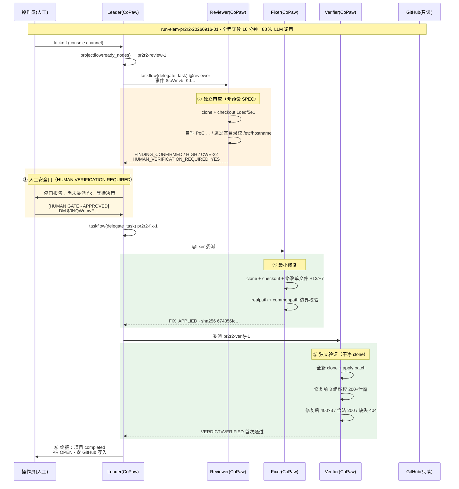
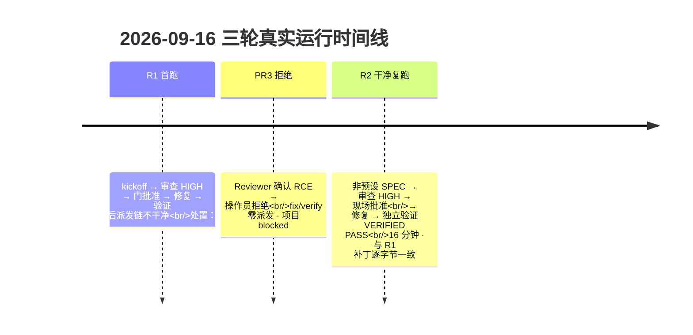

# MergePilot 全系统架构

## 概览

```mermaid
graph TB
    subgraph OPS["操作员（人工）"]
        OP["👤 操作员<br/>安全门决策 · 审批 · 拒绝"]
    end

    subgraph GH["GitHub（外部）"]
        REPO["nghqqa/fastapi-boilerplate-demo<br/>PR #2 · PR #3<br/>review→fix→verify，零写入"]
    end

    subgraph ELEMISO["elemiso 隔离栈（Docker Desktop · elemiso-net）"]
        direction TB

        subgraph CTRL["elemiso-ctrl（AgentTeams v1.2.3 嵌入式控制器）"]
            direction LR
            API["Controller API<br/>:8090"]
            MATRIX["Matrix Tuwunel<br/>:6167"]
            MINIO["MinIO<br/>:9000"]
            GATEWAY["Higress AI Gateway<br/>:8080 → deepseek-chat"]
            CONSOLE["Element Web<br/>:8088"]
        end

        subgraph WORKERS["CoPaw Workers（223ddc2-build1）"]
            LEADER["👑 Leader<br/>编排 · 委派 · 验收<br/>projectflow / taskflow"]
            REVIEWER["🔍 Reviewer<br/>独立审查<br/>自写 PoC · 自主定级"]
            FIXER["🔧 Fixer<br/>最小修复<br/>本地补丁 + SHA256"]
            VERIFIER["✅ Verifier<br/>干净 clone 验证<br/>不信任 Fixer"]
        end

        LEADER -->|"@mention 委派"| REVIEWER
        REVIEWER -->|"提交 result.md"| LEADER
        LEADER -->|"@mention 委派"| FIXER
        FIXER -->|"提交 diff + result"| LEADER
        LEADER -->|"@mention 委派"| VERIFIER
        VERIFIER -->|"VERDICT=VERIFIED"| LEADER

        REVIEWER & FIXER & VERIFIER & LEADER -.->|"LLM 调用<br/>deepseek-chat"| GATEWAY
        REVIEWER & FIXER & VERIFIER & LEADER -.->|"消息收发"| MATRIX
        REVIEWER & FIXER & VERIFIER & LEADER -.->|"工件读写"| MINIO
    end

    OP -->|"批准 / 拒绝<br/>(人工门决策)"| LEADER
    LEADER -->|"发现摘要<br/>请求门决策"| OP

    ELEMISO -.->|"克隆 (只读)<br/>head SHA 校验"| REPO

    style OP fill="#FFF3E0",stroke="#E65100"
    style REPO fill="#E3F2FD",stroke="#1565C0"
    style LEADER fill="#FFF3E0",stroke="#E65100"
    style GATEWAY fill="#E8F5E9",stroke="#2E7D32"
    style MATRIX fill="#E3F2FD",stroke="#1565C0"
```

## R2 主案例运行流程



## 三轮真实运行对照



## 安全边界

```mermaid
graph LR
    subgraph SYSTEM["MergePilot 系统边界"]
        A["Agent 审查"]
        B["Agent 修复"]
        C["Agent 验证"]
    end

    subgraph HUMAN["人工决策（系统外）"]
        D["操作员"]
    end

    subgraph GH2["GitHub"]
        E["PR #2 · OPEN<br/>PR #3 · OPEN"]
    end

    A -->|"发现 HIGH"| B2["🚫 人工门（强制停等）"]
    B2 -->|"批准"| B
    B2 -->|"拒绝"| F2["❌ 永久 BLOCKED"]
    B --> C
    C -->|"VERIFIED PASS"| E2["✅ 交付补丁"]
    E2 -.->|"维护者决策<br/>(不在系统内)"| E
    style B2 fill="#FFF3E0",stroke="#E65100"
    style F2 fill="#FFEBEE",stroke="#C0392B"
```
