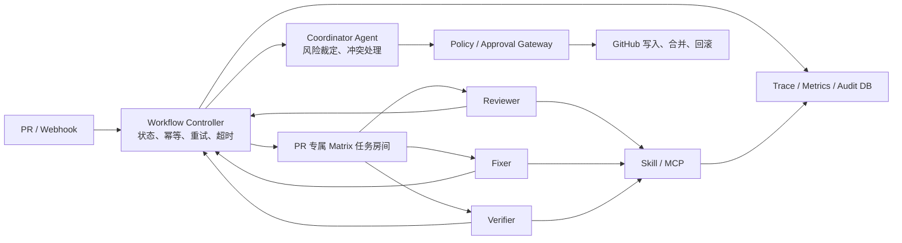

# MergePilot · 复赛工程执行路线图（唯一主计划）

> 版本：V0.4 → V0.5  
> 最后更新：2026-07-25  
> 复赛提交截止：2026-09-03  
> 赛事页面：https://www.goaihz.com/tracks?track=infra

## 0. 本文件怎么使用

本文件是 MergePilot 后续复赛开发的**唯一执行主计划**。

- `docs/项目状态.md`：记录当前已经验证的事实。
- 本文件：决定下一步做什么、以什么标准验收。
- `docs/复赛MVP任务分解-MergePilot.md`：保留为早期规划参考，不再作为当前排期依据。
- 初赛材料和 PPT：属于阶段交付物，不作为工程任务状态来源。

执行原则：

1. 同一时间只推进一个最高优先级里程碑，不并行堆叠非必要工具。
2. “完成”必须同时满足：代码完成、验收通过、证据落盘、文档同步。
3. 规划能力不得写成已运行能力。
4. 每完成一个里程碑，都要更新本文件状态和 `docs/项目状态.md`。
5. 评审不按工具数量评分，优先保证必要性、接口契约、权限边界、端到端证据和可复现性。

---

## 1. 项目定位与复赛目标

MergePilot 面向企业软件研发场景，使用多 Agent 完成：

```text
PR 接入 → 审查 → 修复规划/执行 → 验证 → 风险审批 → 合并/回滚 → 审计与经验沉淀
```

核心差异不是“再做一个 AI Code Review”，而是：

> **不止提建议，而是完成受治理的修复闭环：低风险自动推进，高风险必须人控，失败可以回滚，全程可以审计。**

复赛最终目标：

1. 至少一个正向场景可以零人工 nudge 完成审查、修复、验证和策略裁定。
2. 一个负向场景可以在验证失败后自动进入正确的重试、HOLD 或回滚分支。
3. 一个 L2 场景能被权限门禁可靠拦截，只有人工审批后才能执行高风险动作。
4. 核心 Skill 有真实实现、稳定契约、测试和多 Agent 复用证据。
5. Demo 可以一键复现，并提供 Trace、Metrics、报告和审计记录。

---

## 2. 赛事评分映射与当前判断

| 评分维度 | 权重 | 当前基础 | 主要缺口 | 对应里程碑 |
|---|---:|---|---|---|
| 场景价值与行业可复制性 | 25% | 真实 PR 审修闭环已验证 | 缺少效率、成本、准确率和基线对比 | M5 |
| 多 Agent 协同与自主闭环 | 25% | 4 Agent、任务房间、零人工 nudge 已验证 | 状态机、幂等、异常恢复、冲突处理待固化 | M3 |
| Skill 工程体系与生态复用 | 25% | SASTScan、CaseRetrieval 核心已验证 | 设计多、完整实测少；Schema/版本/质量体系不足 | M4 |
| 工程落地、运行验证与安全审计 | 20% | GitHub MCP、回滚链、PG 审计、RAG 已验证 | 自动回滚、最小权限、实时 Trace、可复现部署待补 | M2、M3、M6 |
| 开放/开源贡献 | 5% | Apache-2.0、README、第三方说明已具备 | 最新代码和证据尚未全部同步公共仓库 | M2、M7 |

当前策略判断：

- 不换题：软件研发全流程协同与赛题高度匹配。
- 不盲目增加 Agent：继续采用 4 个运行 Agent 承载 6 类职能。
- 不堆云产品：先完成可靠控制面、Skill、评测和证据，再按必要性接可观测或官方 Skill。
- 不扩张到完整 SDLC：把 PR 审修、风险门和失败恢复做到可验证。

---

## 3. 目标架构决策

### 3.1 采用“确定性控制面 + Agent 语义决策面”

LLM Agent 适合审查、分析、生成方案和语义裁定，不适合承担必须严格可靠的状态推进、幂等、超时和重试。

目标架构：



职责边界：

- **Workflow Controller**：持有唯一任务状态，负责阶段转换、事件去重、超时、重试和断点恢复。
- **Coordinator Agent**：负责语义决策、风险裁定、冲突处理和最终动作建议。
- **Reviewer/Fixer/Verifier**：专注各自业务职责，不自行决定越权动作。
- **Policy/Approval Gateway**：在工具层强制执行权限和审批，不依赖 Prompt 自觉。
- **Matrix 任务房间**：用于可见协作和会话隔离，不作为唯一状态数据库。
- **PostgreSQL**：保存任务状态、审计事件、决策和知识数据。

### 3.2 状态机必须成为唯一事实来源

建议状态：

```text
RECEIVED
  → REVIEWING → REVIEWED
  → APPROVAL_PENDING（L2 或策略要求）
  → FIXING → FIXED
  → VERIFYING
      ├─ PASS → POLICY_GATE → MERGED / HOLD
      └─ FAIL
          ├─ attempts < N → FIXING
          ├─ 未合并 → HOLD / CLOSE
          └─ 已合并或已发布 → ROLLBACK_PENDING → ROLLED_BACK → REVERIFY
```

每次阶段执行必须带：

```text
run_id + task_id + stage + attempt + idempotency_key
```

---

## 4. 已完成基线

### M0 · 初赛材料与核心原型 —— ✅ 已完成

- 初赛 PPT/PDF、作品简介、Agent Identity、Skill 清单、代码包和证据看板已完成。
- 4 个运行 Agent 已在 AgentTeams/HiClaw 环境运行。
- 真实 GitHub MCP 读、写、创建 PR、合并链路已验证。
- Worker 不持有 GitHub PAT，凭证位于隔离 sidecar。
- 本地 PostgreSQL 16 + pgvector、审计数据和 RAG 小样本召回已验证。
- 坏修复 → 验证 FAIL → revert → 复验 PASS 的回滚执行链已验证。

### M1 · 零人工 nudge 阶段交接 —— ✅ 已验证

- 仅靠 SOUL 约束无法确保 Manager 每次可靠继续。
- `handoff_watcher.py` 已验证可以检测 `TASK_COMPLETED` 并推进下一阶段。
- 干净环境中完成 reviewer → fixer → verifier → 裁定，全程无人工 nudge。

### M1.5 · 每任务独立房间与会话隔离 —— ✅ 已验证

- 每个 PR 创建专属 Matrix 任务房间。
- OpenClaw session 按房间隔离，解决跨 PR 上下文污染。
- Worker 可以自动加入任务房间。
- Worker 只响应带 `formatted_body + m.mentions` 的真实 @mention。
- `handoff_watcher_v2.py` 已在任务房间内直接推进阶段。
- PR #6 场景跑通；Fixer 创建真实 PR #7；Verifier 正确输出 L2 HOLD。

---

## 5. 后续里程碑

### M3-A · 可靠工作流控制(PG 权威 + Outbox + /sync)— ✅ E2E PASS / evidence closed

**状态**:E2E PASS / persistent idempotency verified / crash recovery verified / evidence closed
**run_id**: `m3a-final-20260726-04`
**验证日期**:2026-07-26
**证据**: `evidence/m3a-final-04/`
**git 标签**:`m3a-e2e-pass`(8db5b9f,E2E 闭合) / `m3a-evidence-closed`(72a7005,崩溃恢复复验 5/5 修正后闭合,不移动旧标签)

#### 已验证

- **PG 权威状态**:task_runs + stage_runs + stage_events + dispatch_outbox + controller_offsets 五表。
- **原子事务**:状态转换 + outbox 写入同一个 PG 事务。
- **Outbox 幂等派发**:idempotency_key UNIQUE;矩阵 txnId 用 sha256(idempotency_key);重试有退避(5s→10s→20s→30s→60s,>10 次 FAILED)。
- **/sync 增量消费**:持久游标(controller_offsets);不依赖内存 seen。
- **event_id 去重**:stage_events.event_id PK;重复 TASK_COMPLETED → DUPLICATE。
- **VERIFY 流式快照处理**:无 `VERDICT=` 的中间快照 → PARTIAL(不终结阶段);完整 `VERDICT=` 消息 → PROCESSED。
- **VERIFY RUNNING 幂等**:已 COMPLETED 后重复事件 → DUPLICATE(不重复更新 task 终态)。
- **Submitter 成员门禁**:4 成员(reviewer/fixer/verifier/manager)全 join 才发 TASK_SUBMITTED。
- **单一派发源**:Controller Outbox 是唯一 @mention 来源(submitter 不直接派发)。
- **崩溃恢复**:docker restart Controller → task/stage/outbox/events 计数无变化。
- **m3a-verify.sh**:12 项全部 PASS。

#### 修复历史(6 个阻断问题)

| # | 问题 | 修复 |
|---|---|---|
| ① | Verifier 裁定全文扫描误判局部 PASS | 改为只解析 `VERDICT=PASS\|FAIL\|BLOCKED` 独立行 |
| ② | Controller 只解析 VERDICT= | 流式快照无 VERDICT= → PARTIAL,不终结 |
| ③ | Verify 缺少 RUNNING 幂等 | 增加 `SELECT ... FOR UPDATE` + DUPLICATE |
| ④ | Submitter 双重派发(@reviewer + outbox) | 删除直接 @reviewer,只发 TASK_SUBMITTED |
| ⑤ | stage_events 无 run_id/stage | 处理完成后回填 |
| ⑥ | m3a-verify.sh 假阳性 | 强化到 12 项检查 |

#### 异常样例(保留)

- `m3a-final-20260726-02`:HOLD / AGENT_NOT_JOINED(fixer 未 join)
- `m3a-final-20260726-03`:HOLD / UNKNOWN(流式快照误消费,修复前)

#### 范围冻结

M3-A 范围已冻结。后续修改(最小权限、FAIL 重试、ACK 等)通过 M3-B/M3-C 推进。

#### 任务

- [ ] 将以下最新实现整理并同步到 `mergepilot-os`：
  - `handoff_watcher.py`
  - `handoff_watcher_v2.py`
  - `submit_pr_taskroom.py`
  - `create_task_room.py`
  - `post_mention.py`
  - `room-recent.py`
  - 对应启动和复现脚本
- [ ] 增加 `.gitignore`，排除 `__pycache__`、临时日志、凭证和运行态文件。
- [ ] 修复 Watcher 日志中阶段名硬编码/错误文案。
- [ ] 修复分支复用，统一使用 `fix/pr-<number>-<run_id>`。
- [ ] 为 PR #6/#7 固化完整证据包：
  - 任务输入
  - Matrix 阶段消息
  - findings
  - fix result
  - verification report
  - 最终裁定
  - Watcher 日志
- [ ] 更新公共 README 和 `docs/项目状态.md`，去掉“仍偶需人工 nudge”的过时描述。
- [ ] 提供一个统一 Demo 启动入口，不再要求评委手工组合多个零散脚本。

#### 验收标准

- [ ] 公共仓库工作树干净，最新实现已提交并可访问。
- [ ] 新环境按 README 可以重建任务房间版本的闭环。
- [ ] PR #6/#7 证据可从 `run_id` 一路追溯。
- [ ] Python 代码通过语法检查，核心脚本至少具备 smoke test。

#### 预期证据

```text
evidence/e2e-pr6/
docs/项目状态.md
README.md
git tag v0.4.0
```

---

### M3-B · 最小权限与审批(工具层权限边界)— B1–B5 ✅ closed

> **身份 = Bearer token(非 URL 路径)+ 私有 mcp-backend-net 网络隔离 + fail-closed + policy.yaml 版本化 + policy_action_outbox(继承 M3-A 幂等)。**

| 子任务 | 状态 | 内容 |
|---|---|---|
| B0 调研 | ✅ | mcporter 支持 `--header`;bridge = mcp-proxy 0.12.0 SSE;worker 与 bridge 同网段,旁路实测可直连 |
| B1 封闭旁路 + 角色 token | ✅ closed `m3b-b1-closed` | gateway(mcp SDK server fronting bridge)+ 4 角色 opaque token + path/token 一致性 + github-mcp 移到私有 mcp-backend-net + INSERT-only 审计表 |
| B2 最小权限矩阵 | ✅ security-closed `m3b-b2.2-closed` | policy.yaml deny-by-default。**B2.1**:修 3 绕过(from_branch、coordinator 过权、repo allowlist 只覆盖写)+ update_pull_request 字段白名单 + 5 工具全禁。**B2.2**:搜索 boolean 逃逸闭合(拒用户 scope,gateway 注入 repo:<allowlist>)+ 残留过权禁用(issue_write/sub_issue_write/update_pull_request_branch/get_teams 等)+ 测试非零退出码 + 审计按时间戳过滤。25/25 PASS,12 工具 disabled |
| B3 不可变审计强化 | ✅ closed `m3b-b3-closed` + `b3.1` + `b3.2` | INSERT-only 账号 + 写 fail-closed + correlation_id 事件。**B3.1**:幂等 phase/decision CHECK + 角色脚本始终收敛 + init fail-fast(set -e+ON_ERROR_STOP,失败不替换 gateway)+ 逐项权限断言。**B3.2**:修 `set -e` 在 `out=$(psql 被拒)` 处中止的确定性回归(改 `if out=$(...)` 条件式 + SELFTEST_FAIL 累计 + exit 非0);测试断言角色脚本 exit 0 + drift 前 INSERT,SELECT + 完整 deploy 容器替换 healthy。24/24 PASS |
| B4 审批票据 + action_outbox | 设计 v2 ✅ + B4a/a.1/a.2/a.3 ✅ + B4b ✅ `m3b-b4b-closed` + B4c ✅ `m3b-b4c-closed` + B4d ✅ `m3b-b4d-closed` + B4d.1 ✅ `m3b-b4d.1-closed` + B4c.1 ✅ `m3b-b4c.1-closed` + B4c.1.1 ✅ `m3b-b4c.1.1-closed` + B4c.1.2 ✅ `m3b-b4c.1.2-closed` + B4c.1.3 ✅ `m3b-b4c.1.3-closed` + B4c.1.4 ✅ `m3b-b4c.1.4-closed` + B4c.1.5 ✅ `m3b-b4c.1.5-closed` + B4c.1.6 ✅ `m3b-b4c.1.6-closed` + B4c.1.6a ✅ `m3b-b4c.1.6a-closed` + B4e ✅ `m3b-b4e-closed` | L2 动作审批闭环。**设计 v2**([docs/M3-B4-审批票据与Action-Outbox设计.md](M3-B4-审批票据与Action-Outbox设计.md))已通过。**B4a**:DB schema + 10 个 l2_* SECURITY DEFINER 函数 + 两个 EXECUTE-only 账号。**B4a.1–a.3**:owner=mergepilot_l2_owner(NOLOGIN)+ payload/binding 一致性 + JSON 类型校验 + 完整签名 allowlist + pgvector 经 pg_depend 恢复 + 精确 ACL + 漂移收敛。61/61 PASS。**B4b**:Gateway L2 claim 流(claim→TOCTOU→上游→complete/fail/mark_unknown)+ asyncio.wait_for 超时(TOCTOU→FAILED,写→UNKNOWN)+ 三态 l2_exec(APPLIED/CAS_MISMATCH/DB_ERROR)+ FAULT_INJECT 门(/tmp/.test_mode)+ 故障路径覆盖(bad-audit/timeout/reject/complete-error/close/并发/生产断言)。15+13/28 PASS。**B4c**:Controller 侧 L2 审批闭环(run 级 gating + GitHub 权威绑定发现 + 幂等建票 + lease drain + 延迟对账)+ 并发/崩溃/E2E。**绝不自动重 merge UNKNOWN/EXECUTING**(审计 `L2_CLAIMED` 计数恰好一次);per-run advisory lock + `FOR UPDATE SKIP LOCKED` + 双唯一索引并发互斥;fail-closed 启动;故障域分离(L2 域不 gated by Matrix)。B4c-0..5 累计 38+19+(32+36)+(31+7)+31+20+42 PASS(见 [evidence/m3b-b4c/](../evidence/m3b-b4c/README.md))。**B4d**:approve CLI(`tools/approve.sh`,host-only,`mergepilot_approver` EXECUTE-only 账号);list/show/approve;`approved_by` 硬派生自 `id -un@hostname`(**不可参数伪造**);拒绝过期/非 PENDING/重复/不存在;凭证不进日志。16/16 PASS(fixture 隔离,见 [evidence/m3b-b4d/](../evidence/m3b-b4d/README.md))。**B4d.1 hardening**:`l2_approve` 改用 `session_user` 写 `approved_by`(忽略参数,签名不变),approved_by **真正不可伪造**(直调 `l2_approve('tkt','evil')` 仍记 session_user);逐人身份 = 逐人 DB 登录角色。补:严格参数(多余参数 exit 2)、缺票显式失败 + `[PASS -eq 18]`、fixture PR 清理(`gh.exe` interop)、证据去尾随空白。18/18 PASS。**B4c.1 收敛与调度加固**:确定性拒绝(`l2_reject_approved` claim 前终结)、typed Gateway outcome(deny/transient/global 分类)、公平调度(`l2_next_attempt_at` + 发现期限代替计数 HOLD + `pg_try_advisory_lock`)、单循环工作预算(`monotonic()` deadline)、Gateway circuit breaker + 降级启动(TCP 不可达→DEGRADED_NETWORK 不 fatal)。26/26 PASS(fixture,见 [evidence/m3b-b4c-hardening/](../evidence/m3b-b4c-hardening/README.md))。**B4e**:总 E2E —— review→fix→verify(VERDICT=PASS)→discover→ticket→**approve.sh**→drain→MERGED(真 squash merge)+ lease 崩溃恢复(真容器 restart run_forever)+ UNKNOWN/EXECUTING 对账(绝不重 merge,L2_CLAIMED 计数不变)+ Gateway 降级→恢复(circuit breaker 开 → 自动恢复 → MERGED)+ Matrix 非 L2 循环存活(降级期 Loop B 真 Matrix 派发 matrix_event_id,独立于 Gateway)。Agent 决策由 `process_event` 确定性注入(LLM 不可复现韧性)。43/43 PASS(连续两次稳定),fixture 隔离(`e2e-lib.sh` + `policy-gw-e2e` + `e2e_guard`),4×L2_CLAIMED/4×L2_COMPLETE 无双 claim,无凭证泄漏/AI 标识(见 [evidence/m3b-b4e/](../evidence/m3b-b4e/README.md))。**待做:B5**(负向证据 8 项)。 |
| B5 负向证据(8 项) | ✅ closed `m3b-b5-closed` | 直连拒/list 过滤/跨角色拒/fixer 写约束/票据伪造-过期-重复拒/合法票据只成功一次/全审计。50/50 PASS，连续两次稳定，fixture 隔离 |

> B5 已闭合；B4 汇总段中的旧“待做:B5”文字以本行和项目状态中的闭合记录为准。

**B1 已验证属性**:直连 bridge 旁路封闭(worker 无法解析 github-mcp)、角色 token 认证(无 token→BAD_TOKEN、跨角色→ROLE_PATH_MISMATCH)、coordinator token 未进任何 worker、审计表 INSERT-only(触发器拦 UPDATE/DELETE)。

**B1 已知边界(后续补)**:审计 fail-open(B1 写入故障不阻断业务;B3/B4 改 fail-closed)、工具级矩阵未上(reviewer 认证后仍可调 merge,B2 过滤)、L2 票据门禁未上(B4)。

---

### M3 · 可靠工作流控制、最小权限与自动失败恢复（P1）

**目标**：从“Watcher 能推进”升级为“确定性 Controller 可以安全、幂等、可恢复地推进”。

#### 任务 A：Controller 与状态存储

- [ ] 将 Watcher 重构为正式 `workflow-controller`。
- [ ] PostgreSQL 增加 `task_runs`、`stage_runs`、`stage_events` 或等价结构。
- [ ] 使用 `(room_id, task_id, stage, attempt)` 去重重复完成事件。
- [ ] 每个阶段记录开始、完成、失败、耗时、Agent、输入摘要和输出证据路径。
- [ ] 实现 timeout、最大重试次数、HOLD 和人工接管。
- [ ] Controller 重启后可以从数据库恢复未完成任务。
- [ ] 支持至少两个 PR 并行运行且互不污染。

#### 任务 B：最小权限与审批

- [ ] 建立 Agent × GitHub MCP 工具权限矩阵：
  - Reviewer：只读 PR/diff/file。
  - Fixer：创建唯一修复分支、写允许路径、创建 PR。
  - Verifier：只读修复分支、触发/读取验证。
  - Coordinator：满足策略后才允许 merge/revert/close。
- [ ] 增加仓库 allowlist、分支 allowlist，禁止 force-push。
- [ ] L2 动作必须携带可审计审批票据。
- [ ] PR 描述、代码注释和文件内容全部视为不可信输入，增加 Prompt Injection 防护规则。
- [ ] 每次 MCP 调用记录调用者、工具、目标、结果和 SHA。

#### 任务 C：状态感知的失败处理 — ✅ closed `m3c-closed`（delivery `c8a2433`，tag object `ec5438b`）

- [x] Verifier FAIL 优先回退 Fixer，并限制最大轮次（`MAX_VERIFY_ATTEMPTS=3`：未达上限回退 Fixer，达上限 → HOLD，不自动 CLOSE）。
- [x] 未合并 PR 超限后进入 HOLD/CLOSE，不错误执行 git revert（未合并 FAIL 零 revert，仅合并后失败才触发回滚）。
- [x] 已合并/已发布变更失败后进入 revert 流程（`POST_MERGE_VERIFY_FAILED` 结构化入口，仅 verifier，校验 room/run/repo/pr/result_sha）。
- [x] revert 后必须重新验证；复验仍失败则升级人工处理（reverify PASS→RECOVERED，FAIL→HOLD，不二次回滚）。
- [x] 回滚动作写入结构化审计事件（`rollback_runs` + `mcp_calls` + `stage_events` 全程留痕）。

**实现要点**：revert 走 **child-run 模型**（`parent_run_id`+`revert_run_id`，独占 revert binding/ticket/L2 链，复用正常 `drain`→MERGED）；changed-files / merge-parent / 恢复内容一律由 GitHub `get_commit`/`get_file_contents`/`list_commits` 权威派生（修复 `EmbeddedResource` 真内容被丢弃）；L2 前重验 `main==bad merge` + `revert PR head==parent`，冲突/读失败/不支持 diff → HOLD（fail-closed）；迁移非破坏幂等（零 `DROP TABLE`）。

**验收**：M3-C E2E **33/33 连续两次**；B4 回归未破坏（B4c.1.6 5/5、B4e 43/43、B5 50/50）；fresh-DB 完整链 9/9 rc=0 + Schema 断言 19/19 + `m3c_state.sql` 独立重入 rc=0；fixture 0 PR/仅 main；M3-C DB residue=0；无凭据/无 AI 标识。证据见 [evidence/m3c/](../evidence/m3c/README.md)。

> ⚠️ **技术债 MIG-B4-001**（B4 链，非 M3-C）：`m3b_b4.sql` 经 B4d.1 函数签名演化后不能跨版本重放（全链二次重放 8/9，`m3b_b4.sql` XFAIL）；支持的生产路径为按版本 forward-only 单次应用。**M7 空环境最终复现前**须由正式 migration runner 记录版本/已应用集，或对齐 `l2_approve` 签名。

#### 预期证据

```text
evidence/m3c/                  # M3-C E2E 33/33 + fresh-DB 闭合 + 回归副本
evidence/m3c/regression/       # B4 未破坏回归(B4c/B4e/B5)
```

---

---

### M4 · 核心 Skill 工程化（P2）

**目标**：从“11 个 Skill 设计、少量实测”收敛为 5–6 个真正完整、可测试、可复用的核心 Skill。

#### 进展（权威以标签为准）

- **M4-A ✅ `m4a-runtime-closed`**：公共 Contract（Draft 2020-12）/ runtime / 75 项契约测试已闭合。M4-B 期间对 `skills/common/runtime/cli.py` 做窄范围加固（所有错误发射经 `_finalize` 脱敏，旧标签原位未动；M4-A 75/75×2 回归通过）。
- **M4-B ✅ `m4b-diff-risk-closed`**（peeled `07cc3da`）：diff-parse + risk-classify 已发布（96 测试×2）。
- **M4-C ✅ `m4c-sast-test-closed`**（peeled `83442be`）：`sast-scan` + `test-runner` 已发布。**87/87×2，M4-A 75/75 + M4-B 96/96 回归**；真实 WSL2 Docker 四场景 E2E（PASS/TIMEOUT/ERROR/TMPFS_QUOTA）通过，配额场景严格观测 `ENOSPC=28`，容器残留为 0。TestRunner 的生产 container 使用 8 MiB tmpfs，冻结契约为 `artifacts=[]`；trusted-dev subprocess 可返回宿主 artifact digest。证据 `evidence/m4/m4c/`。
- **M4-D ✅ `m4d-pr-lifecycle-closed`**（peeled `1f7e4b4`）
  54/54×2，M4-A 75/75×2、M4-B 96/96×2、M4-C 87/87×2；真实
  Policy Gateway → github-mcp → GitHub fixture 11 场景 E2E 通过且 residue
  全 0。peeled delivery `1f7e4b4`。
- **M4-E ✅ `m4e-case-retrieval-closed`**（peeled `621e3aa`）：CaseRetrieval 已发布。框架中立只读 RAG 检索 Skill，169 测试；Windows 166/3×2、POSIX 158/11（Docker `python:3.10-slim`）；POSIX 真实 tree-stub 3/3。真实 pgvector E2E 经一次性 Docker `pgvector/pgvector:pg16` fixture（`docker-fixture-e2e.json` schema v2），`all_passed=true`、Docker 残留 0/0、env-file fail-closed。deploy-owned repo scope/DSN/model/timeouts；reader 只读非特权身份 + SQL/core 双层跨 scope fail-closed；`untrusted` 恒为 true。M4-A 75/75 + M4-B 96/96 + M4-C 87/87 + M4-D 54/54 回归。证据 `evidence/m4/m4e/`。
- **M4 全部闭合**。下一主线：AgentTeams 全链集成 + 统一可观测（OTel/SLS）+ 比赛 Demo 收口。

#### 核心范围

| Skill | 主要调用方 | 本阶段目标 |
|---|---|---|
| DiffParse | Coordinator/Reviewer | 真实 PR diff → 结构化变更上下文 |
| SASTScan | Reviewer/Verifier | 扫描与修复后重扫共用 |
| RiskClassify | Coordinator/Fixer/Verifier | 统一 L0/L1/L2 策略和解释 |
| TestRunner | Fixer/Verifier | 隔离执行测试并返回结构化结果 |
| PRLifecycle | Fixer/Coordinator | branch/write/PR/merge/revert 受控工具能力 |
| CaseRetrieval | Reviewer/Fix Planner | 历史案例检索和引用 |

SecretScan、DepVulnCheck 暂时可以作为 SASTScan 子能力，不为数量强拆；CoverageImpact、RunbookRag、Postmortem 在核心完成后再决定是否独立实现。

#### 每个 Skill 的 Definition of Done

- [ ] 有 `SKILL.md` 和独立入口。
- [ ] 有 name/version/input_schema/output_schema。
- [ ] 明确调用条件、依赖、timeout、错误码、重试和降级策略。
- [ ] 明确安全边界和幂等性。
- [ ] 有 happy path、badcase、timeout/依赖失败测试。
- [ ] 有至少两个 Agent 或两个阶段的复用证据。
- [ ] 调用结果进入 Trace/Metrics。
- [ ] 版本使用 semver，并提供升级/回滚说明。

#### 验收标准

- [ ] 至少 5 个核心 Skill 达到上述 DoD。
- [ ] Skill 测试可以通过统一命令执行。
- [ ] SASTScan、RiskClassify、TestRunner 至少各覆盖 10 个样例。
- [x] PRLifecycle 具备工具权限拒绝、HMAC 幂等冲突、真实 merge/close 与
  fixture residue 测试（M4-D ✅ 已发布）。

#### 预期证据

```text
skills/*/SKILL.md
skills/*/schema/
tests/skills/
evidence/skill-evaluation/
```

---

### M5-0 · HiClaw Live 最小闭环（P2.5）

**设计冻结 v2.7 PASS；M5-0A/B 已发布；M5-0C C3 10/10 + D2B-1 17/17+6/6 在 MergePilot-Test 隔离栈验证通过（source_commit=`4b053ef`）；hiclaw_live=false。**

把 M4-F 六 Skill 全链从协议 fixture 切换到真实 HiClaw Manager/Worker/Matrix。设计规格见 [`docs/M5-0-HiClaw-Live设计冻结.md`](M5-0-HiClaw-Live设计冻结.md)。

**因果参与**：Manager 发 M4F_RUN + Reviewer/Fixer/Verifier 发 TASK_COMPLETED（复用 M3 协议）。删除任一 Agent → 链路停止 → FAIL。

**隔离**：独立 Candidate Controller（advisory lock 单例）+ run prefix 双向分区 + 5 层隔离。**数据库契约不变。**

| 增量 | 范围 | 独立验收 |
|---|---|---|
| M5-0A | 身份 + Candidate + advisory lock + /sync 路由 + 隔离 | Manager 真实 M4F_RUN → /sync → 6 jobs |
| M5-0B | DAG→handoff 桥 + Agent SOUL + watcher 排除 | 六 Skill → review/fix/verify 推进 |
| M5-0C | 真实 Gateway/github-mcp + 10 次 live + 3 负向 | 10/10 + 3/3 fail-closed |
| M5-0D | live evidence + hiclaw_live 公式 + 17/17 + 6/6 回归 + tag/push | hiclaw_live=true（22 项） |

> M5-0C/M5-0D 详细边界（M5-0C=10/10 非 1 次、MergePilot-Test 隔离测试 HiClaw 栈非生产、fixer 写角色仅经 pr-lifecycle 写 fixture repo、operator 授权前置、三档"真实"定义）见 `docs/M5-0-HiClaw-Live设计冻结.md` §26（v2.7 极窄勘误）。M5-0C 阶段 `hiclaw_live=false`。

**明确排除**：完整 OTel/SLS、Nacos/RocketMQ、多租户、管理 UI、多仓库、大规模 Benchmark、自动 merge、DB 契约变化。

---

### M5 · Benchmark 与量化价值证明（P3）

**目标**：从单次 Demo 进入数据集级评测，证明多 Agent、风险治理和 RAG 的实际价值。

#### 第一轮正式数据已冻结（2026-08-11，N=10×2）

- **N≥10 最低目标已完成**；N≥20 仍为后续目标。
- **infrastructure completion = 100%**（20/20，受控本地编排为每个 pair 产出 completed、schema-valid run）。
- **semantic case pass 单独列出 = 5/20**（A=2、B=3）：要求 per-case decision 与 finding-level 评估同时正确，**不写成 E2E completion**。
- **finding-level**：A precision/F1 = 36.36%/48.00%，B precision/F1 = 57.14%/63.16%，recall 同为 70.59%；FP 从 21 降至 9。
- **decision accuracy**：A=50%、B=40%（B 风险处置校准仍需改进）。
- **成本**：B token 高 32.95%、API 请求 +80%、mean duration +14.05%。
- **冻结产物**：`benchmark/formal-summary.json`、`benchmark/formal-summary.md`、`benchmark/formal-run-manifest.json`、`benchmark/freeze_formal_results.py`（post-run 机器复算、原子写、幂等、fail-closed；raw combined SHA256=`c863ecd6…`、source-manifest SHA256=`0de4917e…`、secret synthetic=2 / real=0）。
- **明确限制**：受控本地评测（controlled local orchestration），Group B **不是真实 Gateway/controller/GitHub/HiClaw E2E**；不证明多角色提高 recall；不支持真实 fix/verify/rollback 指标；C3 10/10 为独立真实隔离栈证据，不混为一项。

#### 数据集

- 目标：N ≥ 20 个 PR。
- 时间不足时硬下限：N ≥ 10。
- 覆盖：
  - L0/L1/L2。
  - 干净 PR。
  - 密钥、SQL 注入、危险调用、依赖漏洞。
  - 测试失败和修复冲突。
  - 误报/allowlist。
  - Prompt Injection 样例。
  - 回滚场景。

#### 必须统计的指标

- E2E 完成率。
- L2 漏拦截率。
- Finding precision/recall。
- 修复一次通过率和最终通过率。
- 回滚成功率。
- 人工介入率。
- 平均耗时、P50/P95。
- Token/模型成本。
- Trace/审计完整率。
- RAG Recall@1、Recall@3、MRR 和错误引用率。

#### 基线与消融

- [x] ~~至少完成“单 Agent vs MergePilot 多 Agent”的对比。~~ ✅ 第一轮 N=10×2 已完成并冻结（见上方"第一轮正式数据已冻结"）：B 在 precision/F1 上优于 A，recall 持平，decision accuracy 低于 A；受控本地评测非真实 E2E。
- [ ] 建议增加“无 RAG vs 有 RAG”的消融。
- [ ] 记录相同输入下的质量、耗时和成本差异。

#### 目标门槛

- [ ] L2 漏拦截率 = 0。
- [ ] 受控回滚场景成功率 = 100%。
- [ ] 预期路径 E2E 完成率 ≥ 90%。
- [ ] Trace/审计关键阶段完整率 ≥ 95%。
- [ ] 所有指标都附原始结果，不只提供汇总百分比。

#### 预期证据

```text
benchmark/dataset/
benchmark/results.csv
benchmark/report.md
benchmark/raw-runs/
```

---

### M6 · Agent 在环 RAG 与可观测（P4）

**目标**：让 RAG 和可观测进入真实运行链路，而不是独立脚本或事后汇总。

#### RAG

- [ ] 将 CaseRetrieval 封装成 Agent 可调用的 HTTP 或 MCP 服务。
- [ ] Reviewer/Fix Planner 在真实任务中调用。
- [ ] 报告记录案例 ID、相似度、引用内容和是否采纳。
- [ ] Verifier 不因为历史案例存在而跳过当次验证。
- [ ] 知识数据扩展到至少 20–30 条并完成 M5 评测。
- [ ] 入库前脱敏，失败时显式降级为“不使用历史案例”。

#### 可观测

- [ ] 优先实现 Trace + Metrics，不追求一次接齐所有后端。
- [ ] Trace 覆盖：
  - Controller 状态转换。
  - Agent 阶段执行。
  - Skill 调用。
  - MCP 调用。
  - RAG 查询。
  - 审批和 GitHub 写入。
- [ ] Metrics 至少覆盖：
  - 阶段耗时。
  - 成功/失败/重试次数。
  - Token 和模型成本。
  - 人工介入率。
  - Skill/MCP 错误率。
- [ ] 选择一个明确后端：LoongSuite/AgentScope Studio、AgentLoop 或本地 OTel 后端。
- [ ] 如接 SLS Skill，必须让 Verifier 真实查询日志并引用为验证证据；不为展示 Logo 接入。

#### 验收标准

- [ ] 任意 `run_id` 可以查看完整 span 树和关键指标。
- [ ] RAG 调用出现在 Agent 执行 Trace 中。
- [ ] 可从 Trace 定位一次失败发生在哪个 Agent/Skill/MCP。
- [ ] Demo 看板使用真实运行数据，不手填指标。

---

### M7 · 复赛交付与现场准备（P5）

#### M7-P2 RAG Benchmark（已完成）

- [x] **Development Calibration**（`rag-bench-v2`）：N=29 独立 case，确定性离线 `TokenOverlapAdapter`。`benchmark_phase=DEVELOPMENT_CALIBRATION`，`quality_gate_pass=null`——**仅开发校准，不作为确认性质量结论**。
- [x] **Confirmatory Held-out**（`rag-bench-v3-heldout`）：N=25 独立 held-out case（与 v2 完全分离，seed=99）。50 arm executions。**31/31 checks passed**，**16/16 预注册质量门控 PASS**，`confirmatory_all_ok=true`。
  - hit@1=1.0、hit@3=1.0、MRR=1.0、category/severity match=1.0
  - abstention accuracy=0.60（≥0.60）、scope leak=0
  - fault fallback/timeout/malformed=1.0
  - deterministic replay=true、gold/secret/residue=0
  - evidence: `evidence/m7/benchmark/rag-n20-confirmatory.json`（SHA256 `36edc664…`）
- [x] **诚实边界**：`runtime_consumes_rag_context=false`；workflow utility 不可测（`NOT_MEASURABLE_WITH_CURRENT_RUNTIME`）；Verifier 未在该 Benchmark 中实际运行（`NOT_MEASURED`）；使用确定性离线 adapter，**不外推为真实 pgvector/embedding 或生产多仓库效果**。

#### 可执行代码包

- [ ] README。
- [ ] 一键启动/停止入口。
- [ ] `.env.example`，无真实凭证。
- [ ] 配置与依赖说明。
- [ ] 样例输入输出。
- [ ] 自动测试命令。
- [ ] Demo 重放命令。
- [ ] 运行证据索引。
- [ ] Apache-2.0 和 THIRD_PARTY。

#### Demo

主 Demo 建议控制在 4–6 分钟：

1. 提交真实或可重放 PR。
2. 展示任务专属 Matrix 房间。
3. Reviewer 调 Skill/MCP 发现问题。
4. Fixer 创建修复 PR。
5. Verifier 复验。
6. 展示 L2 审批门。
7. 展示一个失败恢复/回滚片段。
8. 使用 `run_id` 打开 Trace、Metrics 和审计证据。

必须准备两条完整录像：

- 正向 PASS/MERGE。
- 负向 FAIL/HOLD/ROLLBACK。

#### 更新版方案

- [ ] 使用实际架构，不再展示已被替代的旧流程。
- [ ] 所有“已实现”都链接到证据。
- [ ] 加入 Benchmark 指标和基线对比。（M7-P2 RAG Benchmark 已完成；单 Agent vs 多 Agent Benchmark 已有 N=10 本地评测）
- [ ] 加入权限矩阵、状态机和失败分支。
- [ ] 明确当前本地 PG 与云上 PolarDB-PG 的边界。
- [ ] 不把 Nacos/RocketMQ/SLS 等规划写成已运行。

#### 答辩准备

- [ ] 为什么不是单 Agent？
- [ ] Watcher/Controller 是否只是脚本编排？
- [ ] 如何抵御 PR Prompt Injection？
- [ ] Worker 没有 PAT 是否仍可能越权？
- [ ] 为什么需要 RAG，数据如何评测？
- [ ] 回滚什么时候触发，如何避免误回滚？
- [ ] 如何证明多 Agent 比单 Agent 更好？
- [ ] 如何从本地环境迁移到企业生产环境？

---

## 6. 时间安排

| 时间 | 主里程碑 | 必须产出 |
|---|---|---|
| 7/25–7/28 | M2 仓库收口 | V0.4 代码、README、PR #6/#7 证据 |
| 7/29–8/03 | M3 Controller/权限/自动失败恢复 | 幂等、恢复、并发、L2、回滚证据 |
| 8/04–8/10 | M4 Skill 工程化 | 5–6 个核心 Skill + 测试 |
| 8/11–8/16 | M5 Benchmark 第一轮 | 数据集、原始结果、初版报告 |
| 8/17–8/24 | M6 RAG/可观测 + 联调 | Agent 在环 RAG、Trace、Metrics |
| 8/25–9/01 | M7 交付物 | 代码包、PPT、Demo 视频 |
| 9/02 | 缓冲与全量复验 | 干净环境从零复现 |
| 9/03 | 提交 | 最终交付 |

如果工期延误，砍项顺序：

1. 先砍 Nacos/RocketMQ 等非必要组件。
2. 再砍额外 Skill，不砍 5 个核心 Skill。
3. SLS 无真实验证价值时改为可选适配器。
4. 不砍状态机、权限、自动失败恢复、Benchmark 和可复现 Demo。

---

## 7. 复赛总体验收标准

代码冻结前必须同时满足：

- [ ] 4 个运行 Agent 职责清晰且真实运行。
- [ ] Workflow Controller 有持久状态、幂等、重试、恢复和并发隔离。
- [ ] 正向、负向、L2 三类场景均有完整证据。
- [ ] 高风险操作的权限边界在工具层强制执行。
- [ ] 至少 5 个核心 Skill 完成工程化 DoD。
- [ ] Benchmark 达到 N ≥ 10，目标 N ≥ 20。
- [ ] RAG 在真实 Agent 调用链中运行。
- [ ] Trace + Metrics 覆盖关键链路。
- [ ] 公共仓库可从干净环境部署和复现。
- [ ] Demo 视频、更新 PPT 和证据索引完成。

---

## 8. 立即执行清单

> 本清单曾对应 M2 阶段（Watcher 幂等 / PR #6/#7 证据 / V0.4.0 标签等），**这些项目已全部完成**（M2/M3/M4 已闭合，初赛基线冻结于 `preliminary-20260811` → `957d7d5`）。原条目保留在下方作为历史记录，不再作为当前排期依据。

### 历史条目（M2 时期，已完成）

1. [x] ~~对比 `D:\goai\tools` 与 `D:\goai\mergepilot-os\tools`，列出需要同步的正式文件。~~
2. [x] ~~给 Watcher 增加 `(room_id, prefix, stage)` 幂等去重。~~（M3-A 闭合）
3. [x] ~~修复唯一分支命名。~~
4. [x] ~~整理 PR #6/#7 的完整证据。~~
5. [x] ~~将任务房间版本同步到公共仓库。~~
6. [x] ~~更新 README、项目状态和复现命令。~~
7. [x] ~~打 V0.4.0 标签。~~

### 当前主线（2026-08-11 起，权威）

下一主线为 **OTel/SLS 可观测 → Benchmark N≥20 → 多仓库稳定性**。D2B-3 socket proxy 已完成（`hiclaw_live=true`，真实 v1.2.2 生产 live 64/64 PASS）。

#### D2B-3A 设计冻结 v1（已完成）

- [x] ~~审计现有 hardening 代码（`disk_guard` / `guarded_start` / `harden_policy` / `install_guarded`）。~~
- [x] ~~设计 v1 契约 + 验收矩阵 + 选型。~~

#### D2B-3A.1 上游差异审计与设计修订 v2（已完成，本轮）

- [x] ~~固定 AgentTeams v1.2.2（commit `849182a`）只读源码审计（不审浮动 main）。~~
- [x] ~~v1.1.2→v1.2.2 破坏性差异（`hiclaw-*`→`agentteams-*` 硬切割重命名；embedded 成为唯一支持路径）。~~
- [x] ~~controller docker.sock 路径确定：`install.sh:4015` 直接挂载 + `docker.go:45` `net.Dial("unix", SocketPath)`。~~
- [x] ~~官方 `agentteams-docker-proxy` 保护边界确定：**不保护 controller**（调用链证据：proxy 仅挂为 `/docker/` 路由 `http.go:134-136`，不在 `backend.DockerBackend` 路径）。~~
- [x] ~~controller 实际 Docker API 清单 SOURCE_PROVEN（13 项，逐行 `docker.go:<line>`）；消除所有 [INFER]。~~
- [x] ~~label 隔离 → name-prefix 隔离（controller 创建的容器无 label，`interface.go:166`）。~~
- [x] ~~B5 label 伪造设计闭合（strip-then-inject + canonical 比较 + 8 类绕过测试）。~~
- [x] ~~唯一推荐方案 C（自研窄代理，利用 `AGENTTEAMS_PROXY_SOCKET`（`config.go:292`）锚点）。~~
- [x] ~~修复 `test_blocked_consistency.py` 过期断言（保留程序化阻塞真实说明）。~~
- 产出（更新）：`docs/D2B-3-Docker-Socket-Proxy设计冻结.md`（v2）、`docs/D2B-3-验收矩阵.md`（v2）、`docs/复赛路线图.md`。
- **边界**：~~设计冻结 ≠ 实现~~ **已完成实现与生产 live 验证**。`hiclaw_live=true`（D2B-3 PASSED）。

#### D2B-3B1 离线实现与 Stub 验收（已完成）

1. [x] ~~proxy daemon 实现（Python，`tools/hiclab/docker_socket_proxy.py`：监听 `/run/mp/docker.sock`，转发到 `/var/run/docker.sock`）。~~
2. [x] ~~`harden_policy.py` 扩展：`evaluate_deny` + `apply_hardening_v2` **strip-then-inject label**（NFKC+casefold canonical 比较，防 B5 伪造）+ `agentteams-*` name regex。~~
3. [x] ~~`guarded_start.validate_proxy_marker_alive` 扩展 pid + config digest 校验（marker 生命周期绑定，B7）。~~
4. [x] ~~受控 stub（`tests/hiclab/proxy_stubs.py`：`FakeUpstreamDaemon`/`ControllerStubClient`/`ProxyHarness`/`InspectStub`）覆盖 §3 全部 13 个 SOURCE_PROVEN 端点。~~
5. [x] ~~验收矩阵 v2 用例全 PASS（`tests/hiclab/test_docker_socket_proxy.py`：106 测试，104 passed + 2 skipped（Windows host AF_UNIX），×2 稳定）。~~
6. [x] ~~`harden_policy._agent_name_from` 扩展双前缀（`agentteams-worker-` + `hiclaw-worker-`）。~~
7. [x] ~~`full tests/hiclab`：365 passed / 0 failed / 2 skipped（无回归，含 marker PID 生命周期 6 项）。~~

**D2B-3B1.1 真实离线传输链补全（已完成）**：
8. [x] ~~真实 `proxy_transport.handle_connection`：HTTP 解析（Content-Length + chunked）+ classify + authoritative inspect + forward/relay（bounded body、101 hijack 双向、fail-closed）。~~
9. [x] ~~`main()` 接受循环 spawn production handler 线程（不再 `conn.close()` 占位）。~~
10. [x] ~~端点收紧：移除 logs/stats/changes/wait/HEAD；严格 query（stop?t=10、delete?force=true）。~~
11. [x] ~~B11 闭合：auth-token archive 路径严格 allowlist（`/var/run/secrets/agentteams[/(token|token.next)]`）；`/etc`、`/`、`..`、双重编码全 DENY。~~
12. [x] ~~`tests/hiclab/test_proxy_transport.py`：64 真实往返测试（13 endpoint round-trip + deny 证 0 upstream hits + exec 自动注册 + hijack 字节 + archive 拒绝 + fail-closed + chunked + 版本前缀 + B11 绕过）。×2 稳定。~~
13. [x] ~~`full tests/hiclab`：409 passed / 0 failed / 2 skipped（含 64 传输 + 106 分类 + 261 现有）。~~

**D2B-3B1.2 权威资源绑定闭合（已完成，本轮）**：
14. [x] ~~`_inspect_authoritative` 收紧：Name + 4 项 label（scope/run_id/agent/hardened）**精确等值**校验；缺一即 DENY；不再用通用 allowlist 兜底。~~
15. [x] ~~`derive_agent_strict`：单一权威 agent 派生函数（transform + inspect 共用，禁止漂移）；允许集合 `{reviewer,fixer,verifier,manager}`；未知 name → None → DENY。~~
16. [x] ~~`POST /containers/{name}/exec` 现在必须经过 authoritative inspect：inspect 失败 → 403，exec-create **不转发**给 upstream（FakeUpstreamDaemon 只收到 inspect）。~~
17. [x] ~~`InspectStub.body()` 默认生成权威 labels（不再有无 label 的"合法"默认）；需无 label 场景显式传 `labels={}`/`no_config`/`no_labels`。~~
18. [x] ~~`TestAuthoritativeBinding`：18 项测试（valid+labels 放行、labels/Config/labels-key 缺失、scope/run_id/hardened/agent 错或缺失、Name 错、labels 非 object、未知 agent、exec 正确绑定注册、manager role、start/delete/archive 错 label 不转发）。~~
19. [x] ~~`test_proxy_transport.py` ×2 稳定（64 测试）；`full tests/hiclab` ×2 稳定。~~

**历史诚实边界（D2B-3B1.x 离线阶段，已被后续 live 验证超越）**：
- ~~本轮为离线 stub 验收~~ → **后续已完成真实 dockerd / AgentTeams v1.2.2 生产 live 验证**。
- ~~marker 写入未在真实 `/etc/hiclab/` 落地~~ → **已在生产环境落地验证**。
- ~~`UPSTREAM_BLOCKED.md` 状态未改（BLOCKED_UPSTREAM）~~ → **已更新为 PASSED（hiclaw_live=true）**。
- **labels 缺失不是兼容模式**：所有经 proxy 创建的新容器都带权威 labels；旧版无 label 容器必须清理或重新创建，不能自动信任。

#### D2B-3B2 隔离环境 Smoke（已完成 ✅）

> 历史记录：D2B-3B2 在 MergePilot-Test 独立 dockerd 完成 42/42 PASS。后续 D2B-3C 在隔离栈完成 82/82 PASS，最终在真实 v1.2.2 生产环境完成 64/64 PASS（`hiclaw_live=true`）。

#### D2B-3C 生产 live（已完成 ✅）

> D2B-3 PASSED：真实 AgentTeams v1.2.2 生产 live 验证（64/64 PASS，`hiclaw_live=true`）。权威 evidence：`evidence/m5/0d/hiclaw-v122-true-live-pass.json`。
