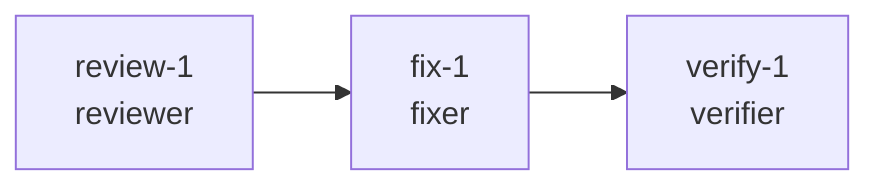

# 案例一：PR #1（wd1-pr1-bootstrap）— 普通多智能体协同案例

> 定位：展示 AgentTeams 的**基线能力**——Leader 编排下的自主 DAG 协同闭环，
> 全程无人工介入。高危安全门能力由 PR #2 案例单独展示（02-case-pr2-high-risk.md）。

## 案例设定

- 仓库：`nghqqa/fastapi-boilerplate-demo`，PR #1（bootstrap 引导 PR，无高危内容）
- 团队：manager（Leader）+ reviewer + fixer + verifier（4 个 copaw worker）
- 编排：Leader 以 `projectflow` 建项目/plan_dag，`ready_nodes` 生成可派发节点，
  `taskflow delegate_task` 经 Matrix `m.mentions` 委派；Worker `ack_task` → 工作 → `submit_task`；
  Leader `check_task`/`check_active_tasks` 验收并在计划图上推进状态。

## DAG 与执行（UTC）

| 时刻 (UTC) | 事件 | 证据 |
|---|---|---|
| 03:59 | review-1 委派 @reviewer（team room，m.mentions） | 房间事件 `$nadwji6tQQkl4vSWDktWAFtWs_enjxAcg23927OKmrU` |
| 04:01:24 | reviewer 消费（`Created queue`→agent 启动） | reviewer 容器日志 |
| 04:02:17 | reviewer `submit_task`（review-1 完成，会话落盘） | reviewer copaw.log |
| 06:17:35 | fix-1 委派 @fixer | 房间事件 |
| 06:20:42 | verify-1 委派 @verifier（fix-1 完成后） | 房间事件 |
| 06:21:17 | verify-1 完成：`TASK_COMPLETED: verify-1` @manager | 房间事件 `$DFlUS-…` 时段 |

要点：三棒全部经**真实 Matrix 消息**触发（非内存调用）；任务文件经 MinIO
`shared/` 双向同步；Leader 的 `check_active_tasks` 具备"assigned 但未运行→催办"的自愈行为。

## 结果

- 三棒全链 `SUCCESS`，review/fix/verify 交付物均在任务目录 `workspace/` 下
- 完整闭环重放证据：`PHASE14-WINDOWS-COPAW-E2E-FULL-20260829-122526`（20/20 SHA256SUMS）、
  `PHASE14-WINDOWS-COPAW-PROMOTION-A-FINAL-20260829-124400`（17/17）
- 与 PR #2 案例的差异：**无人工安全门**——因为 PR #1 的 review 结论为非高危
  （案例设计如此），因此 DAG 直接流转；高危路径见 PR #2 案例

## 与 PR #2 案例的关系

PR #1 证明"协同管道"可用；PR #2 在同一管道上叠加"安全门拓扑"：
`verify 前置的人工审批节点`。两案例共用同一套角色、工具、存储与消息协议，
证明安全门是**拓扑与策略的升级**，而非另一套系统。
