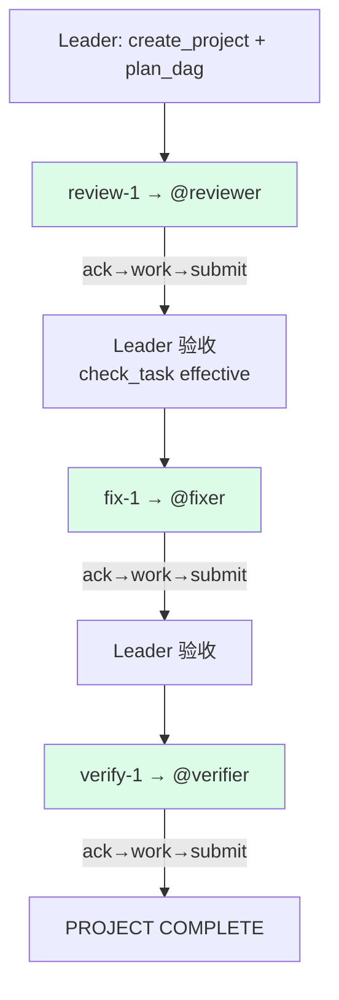
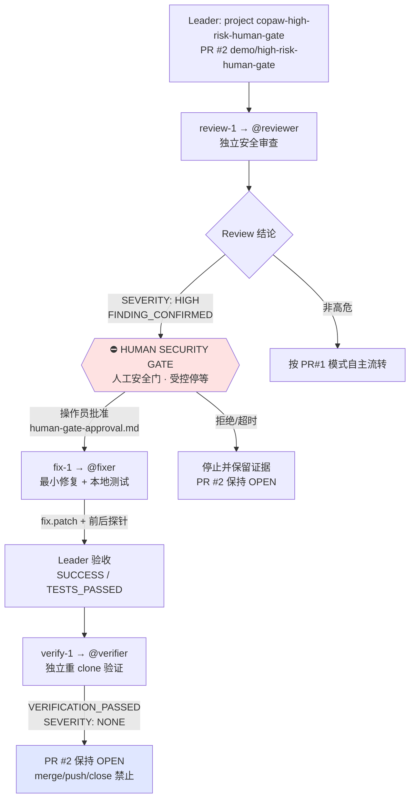
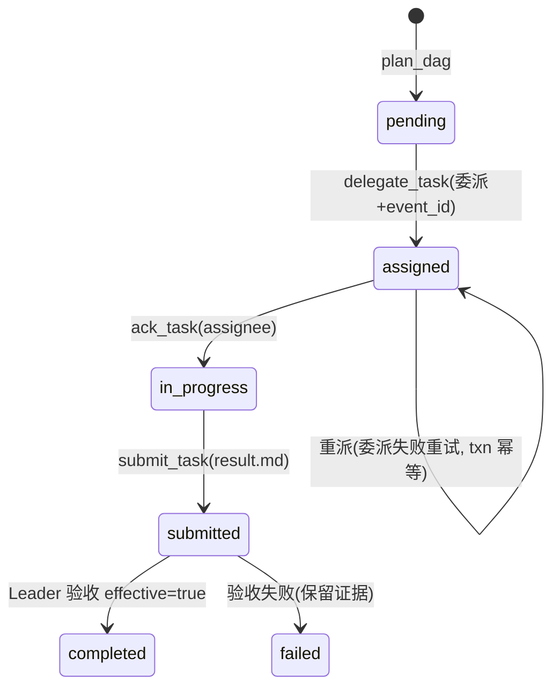

# 双案例 DAG 与状态机

## PR #1（普通协同，全自主）

无人工节点：review 结论非高危 ⇒ Leader 依 `ready_nodes`/依赖关系自主流转。

## PR #2（高危安全门）

## 任务状态机

## 消息/存储协议不变量

1. 委派必须产生**新的有效 Matrix 事件**且 `m.mentions` 命中目标（复用分支仅在
   同项目 + event_id 非空时允许）
2. 任务工件存放 `shared/projects/<pid>/tasks/<tid>/`（project 隔离；平铺旧路径只读兼容）
3. 接收端 event ledger + since-token 回放窗口 ⇒ 消息**至少一次投递 + 幂等消费**
4. 结果协议标记位于 result.md 顶层，Leader 以 `check_task` 的 `effective` 验收
